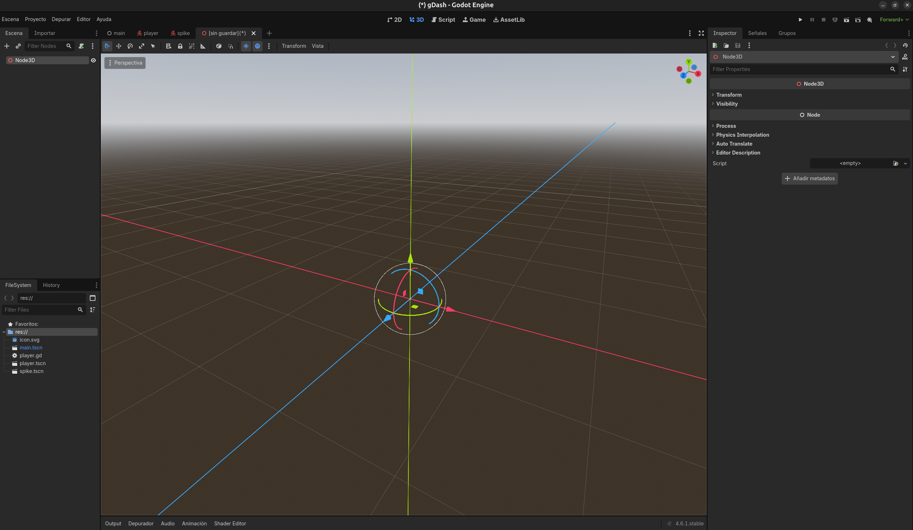
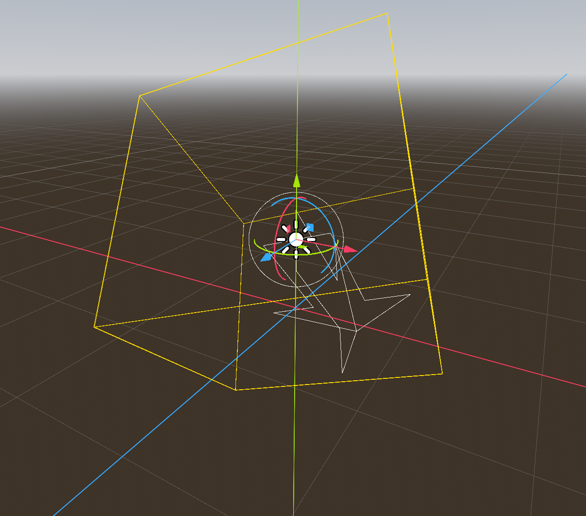

# Crear Proyecto 3D en Godot

Comenzaremos creando un nuevo proyecto en Godot para desarrollar nuestro juego 3D. Seguiremos los pasos del primer capítulo del curso de Godot para configurar nuestro entorno de trabajo; sin embargo, nos centraremos en las opciones específicas para proyectos 3D. En este caso para poder ver mejoras en el rendimiento utilizaremos el render de Forward+ (en caso de que tu tarjeta gráfica no lo soporte, puedes usar el render de OpenGL ES 3.0 (compatibilidad)).

Vamos a proceder a crear la primera escena de nuestro proyecto, la cual será una escena 3D. Para esto, seleccionaremos la opción "New Scene" y luego elegiremos "3D Scene". Esto nos proporcionará un nodo raíz llamado ```Node3D```, que es el nodo base para cualquier escena 3D en Godot.



Como vemos en la imagen, el nodo raíz de nuestra escena es un ```Node3D```, que nos permitirá agregar otros nodos específicos para objetos 3D, luces, cámaras, etc. A partir de aquí, podemos comenzar a construir nuestro mundo 3D agregando los elementos necesarios para nuestro juego.

A este paso guardaremos la escena como ```Main.tscn``` para mantener una buena organización de nuestro proyecto. Es importante guardar nuestras escenas con nombres descriptivos para facilitar su identificación y gestión a medida que nuestro proyecto crece.

Podemos movernos por el espacio 3D utilizando las herramientas de navegación de Godot, lo que nos permitirá posicionar y orientar nuestros objetos de manera efectiva. Además, podemos agregar nodos como ```MeshInstance3D``` para crear objetos sólidos, ```Camera3D``` para configurar la vista del jugador, y ```Light3D``` para iluminar nuestra escena.

## Añadir Luz

Nuestra escena 3D necesita iluminación para que los objetos sean visibles y tengan un aspecto realista. Existen diferentes tipos de luces en Godot, como luces direccionales, luces puntuales o luces de Área. Para este caso, vamos a utilizar una Luz direccional.

Para agregar una luz, realizaremos los siguientes pasos:

1. seleccionamos el nodo raíz ```Node3D``` y luego hacemos clic en el botón "Add Child Node".
2. En la lista de nodos, buscamos y seleccionamos ```DirectionalLight3D```.

Este nodo de luz direccional simula la luz del sol, proporcionando una iluminación uniforme en toda la escena. Podemos ajustar su dirección y color para lograr el efecto deseado. Para cambiar la dirección de la luz, simplemente seleccionamos el nodo ```DirectionalLight3D``` y utilizamos las herramientas de rotación para orientarla correctamente. También podemos modificar la intensidad y el color de la luz para crear diferentes ambientes en nuestra escena.



Es importante que la luz, debe tener las sombras habilitadas para que los objetos en la escena proyecten sombras realistas, lo que mejora significativamente la apariencia visual de nuestro juego. Para habilitar las sombras:

1. Sleccionamos el nodo ```DirectionalLight3D```.
2. En el panel de propiedades, buscamos la sección de _"Shadows"_ y activamos la opción _"Enabled"_. Esto permitirá que los objetos en nuestra escena proyecten sombras basadas en la dirección de la luz, añadiendo profundidad y realismo a nuestro entorno 3D.

Ahora nuestra escena ya tendrá luz y podremos ver mejor nuestros objetos 3D cuando los agreguemos. En las siguientes secciones, aprenderemos a agregar y manipular objetos 3D para construir nuestro juego.