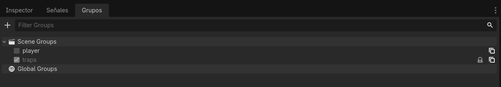

# Game Over (Final de partida)

Comenzaremos con una de las partes más importantes de nuestro juego; el final de la partida. Tenemos que tener en cuenta que nuestro "juego" puede acabar la partida de dos formas: la primera es que el jugador choque con las trampas y la segunda es que el jugador alcance la meta. En ambos casos, el juego se detendrá y se mostrará un mensaje al jugador indicando el resultado de la partida.

## Game Over por choque con trampas

Como ya hemos visto, las trampas son objetos que el jugador debe evitar. Si el jugador choca con una trampa, el juego se detendrá y se mostrará un mensaje indicando que el jugador ha perdido la partida. Para implementar esto, podemos utilizar la función `game_over()` que se llamará cuando el jugador choque con una trampa.

Para ello, vamos a crear un nuevo Script que será el script principal de nuestro juego. Este script se encargará de manejar la lógica del juego, incluyendo el final de la partida.

Para crear este script, seguirems los siguientes pasos:
1. Seleccionamos el nodo principal de nuestra escena `main.tscn`y hacemos clic derecho sobre él, luego seleccionamos "Attach Script".
2. Esto abrirá una ventana donde podemos configurar el script. Asegúrate de que el lenguaje seleccionado sea GDScript y luego haz clic en "Create". 

Esto creará un nuevo script llamado `main.gd` y lo adjuntará al nodo principal de la escena.

Adjuntamos el script que analizaremos después.

```gdscript
extends Node

signal game_over

@onready var player = $player

func _ready() -> void:
	for tramp in get_tree().get_nodes_in_group("traps"):
		tramp.connect("body_entered",_on_body_entered)


func _on_body_entered(body: Node3D) -> void:
	if body.is_in_group("player"):
		game_over.emit()

func _on_game_over() -> void:
	$player.started = false
```

Veamos que incluye este Script:

1. **Señal game_over**: Hemos definido una señal llamada `game_over` que se emitirá cuando el jugador choque con una trampa. Las señales en Godot son una forma de comunicación entre nodos, lo que nos permite emitir eventos y conectar funciones a esos eventos para que se ejecuten cuando la señal se emite.
2. **Función _ready()**: En esta función, conectamos la señal `body_entered` de cada trampa al método `_on_body_entered()`. Esto nos permitirá detectar cuándo el jugador choca con una trampa. La función `get_tree().get_nodes_in_group("traps")` nos devuelve una lista de todos los nodos que pertenecen al grupo "traps", lo que nos permite conectar la señal de cada trampa de manera eficiente.
3. **Función _on_body_entered()**: En este método, verificamos si el cuerpo que ha entrado en la trampa es el jugador. Para esto, utilizamos el método `is_in_group("player")` para comprobar si el nodo que ha entrado en la trampa pertenece al grupo "player". Si es así, emitimos la señal `game_over`.
4. **Función _on_game_over()**: Finalmente, en este método, detenemos el movimiento del jugador estableciendo la propiedad `started` en `false`. Esto hará que el jugador deje de moverse y se detenga el juego. Para que esta función se ejecute cuando se emita la señal `game_over`, debemos conectar la señal `game_over` al método `_on_game_over()`. Esto se puede hacer en el editor de Godot seleccionando el nodo principal, y en el panel de señales, conectando la señal `game_over` al método `_ongame_over()`.


### Grupos

Habrás visto que comprobamos que los objetos jugador y las trampas pertenezcan a un grupo. Esto es una propiedad muy útil a la hora de organizar nuestro juego, ya que nos permite agrupar objetos similares y realizar acciones sobre ellos de manera más sencilla. Para agregar un objeto a un grupo, selecciona el nodo del objeto en la escena y en el panel de propiedades, busca la sección "Groups". Allí puedes agregar el nombre del grupo al que deseas que pertenezca el objeto. En nuestro caso, hemos agregado el jugador al grupo "player" y las trampas al grupo "traps". Esto nos permite verificar fácilmente si un objeto pertenece a un grupo específico utilizando el método `is_in_group()`, como lo hicimos en el método `_on_body_entered()`.



Si probamos nuestro juego, cuando el jugador toma contacto con una trampa, el juego se detendrá y el jugador dejará de moverse, lo que indica que la partida ha terminado. Sin embargo, no mostramos ningún mensaje al jugador indicando que se ha acabado la partida.

En la siguiente sección, veremos cómo mostrar un mensaje de "Game Over" al jugador cuando la partida termine. Para esto, vamos a crear una nueva escena que se mostrará cuando el jugador pierda la partida.