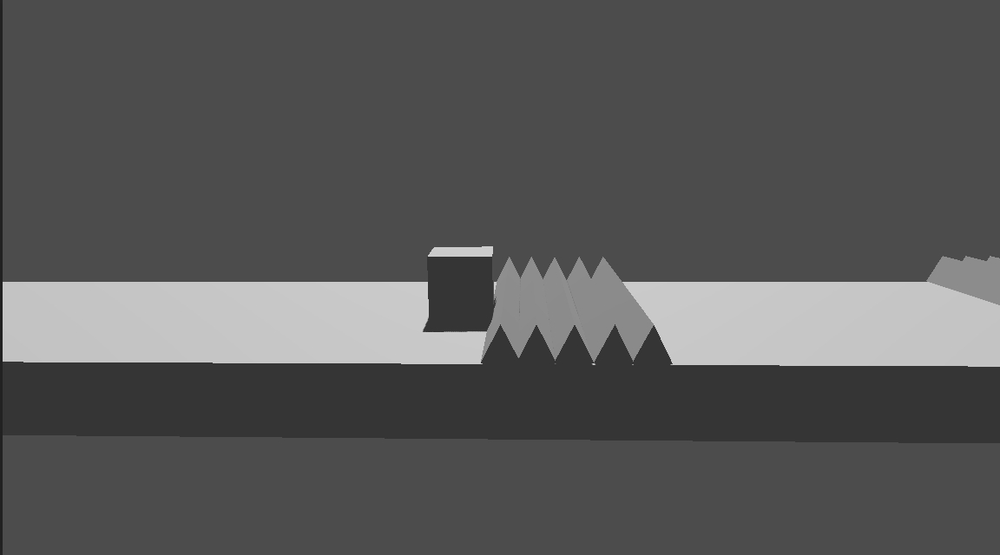

# GDash (Juego en 3D)

Como ejemplo de utilización de Godot para crear un juego en 3D, vamos a desarrollar un juego llamado GDash. En este juego, el jugador controlará a un cubo que debe correr y saltar obstaculos (pinchos) hasta llegar a la meta. Este juego solo es un ejemplo para mostrar cómo se pueden usar las diferentes características de Godot para crear un juego en 3D, y no es un juego completo ni pulido.

En las siguientes secciones, cubriremos los aspectos básicos de cómo configurar tu escena, agregar luces y cámaras, crear el jugador y los obstáculos, y cómo manejar la lógica del juego para que el jugador pueda interactuar con el entorno. Al final de este tutorial, tendrás una base sólida para seguir desarrollando tu propio juego en 3D usando Godot.

Como vemos en la imagen, podemos encontrar diferentes elementos en la escena, como el jugador (el cubo), los obstáculos (los pinchos). Además, de otros elementos que "no vemos" como la luz y la cámara. En las siguientes secciones, aprenderemos a configurar cada uno de estos elementos para crear nuestro juego en 3D.