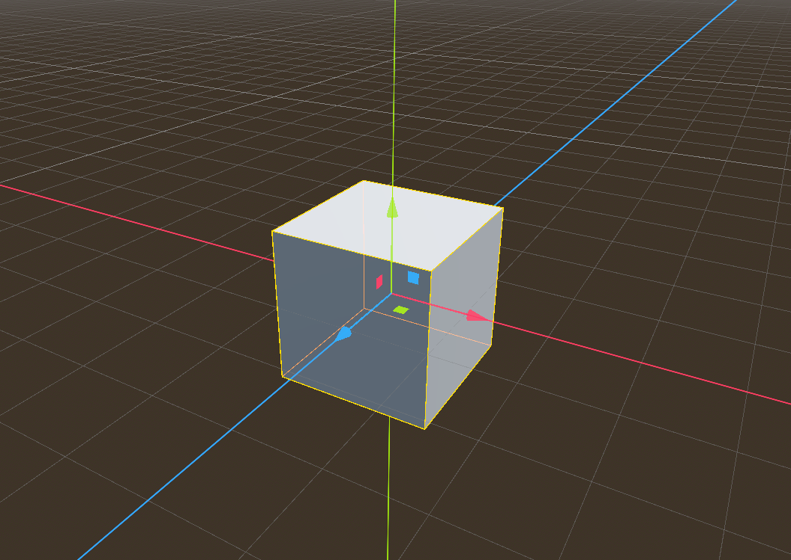
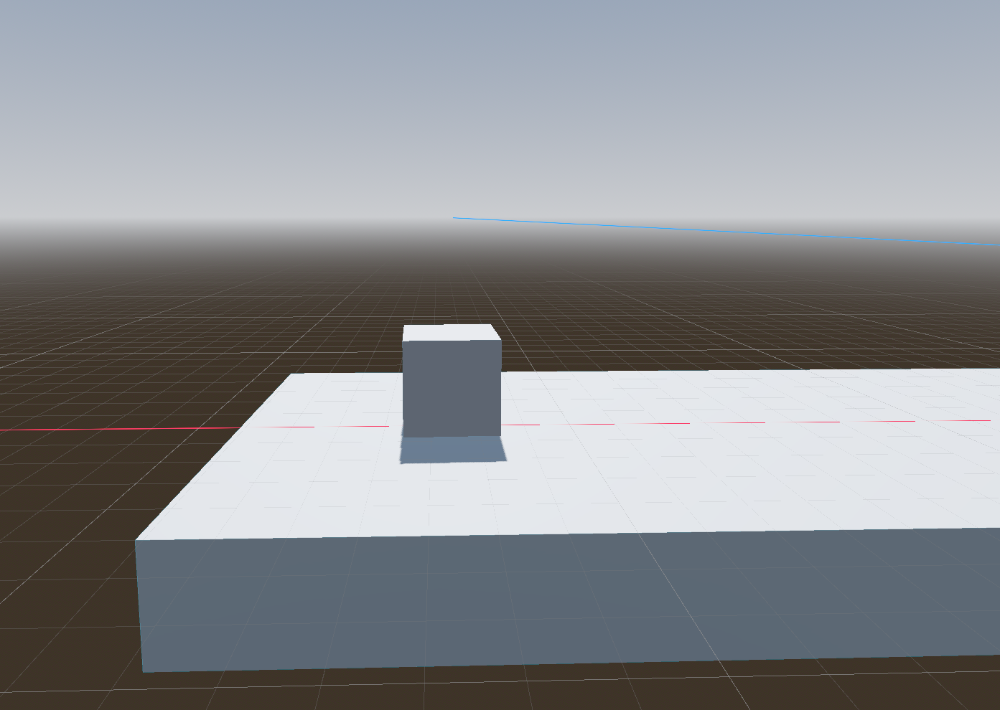
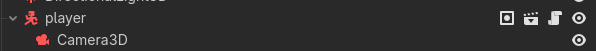
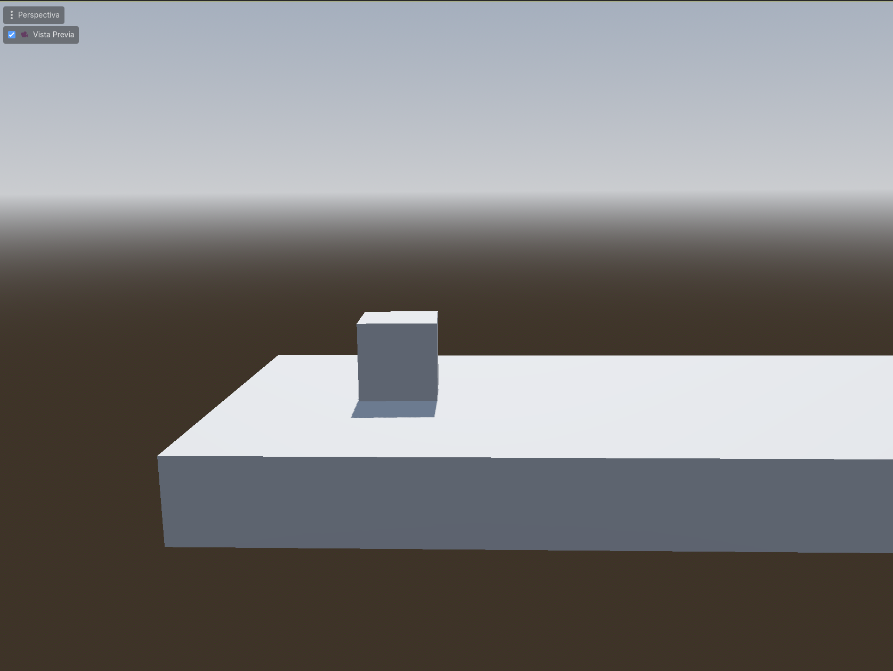

# Jugador

Vamos a crear nuestro jugador; en este caso se trata de un cubo que se mueve por el escenario. para este caso, vamos a crear una nueva escena llamada `player.tscn` (Recuerda que para crear una nueva escena, debes ir a `Scene -> New Scene` o usar el atajo `Ctrl + N`), y dentro de esta escena, vamos a agregar los siguientes nodos:

```
 CharacterBody3D
 ├── CollisionShape3D
 └── MeshInstance3D
```

Para agregar estos nodos, seguiremos los siguientes pasos:
1. Cuando creamos la nueva escena, por defecto un nodo raíz es un tipo `Node3D`; sin embargo, para este caso vamos a utilizar el tipo `CharacterBody3D`; como raíz por lo que lo cambiaremos. Para cambiar el tipo de nodo, haremos click derecho en la escena raíz (el nodo que aparece por defecto) y seleccionaremos la opción "Change Type". Luego, buscaremos `CharacterBody3D` en la lista de nodos disponibles y lo seleccionaremos. Esto cambiará el tipo del nodo raíz a `CharacterBody3D`, que es un nodo específico para personajes que se mueven por el escenario.
2. Ahora añadiremos un nodo hijo de tipo `CollisionShape3D` para definir la forma de colisión del jugador. Para esto, seleccionamos el nodo raíz `CharacterBody3D`, hacemos clic en "Add Child Node" y buscamos "CollisionShape3D". Luego, seleccionamos `CollisionShape3D` para agregarlo como hijo del nodo raíz.
3. Por último, añadiremos un nodo hijo de tipo `MeshInstance3D` para darle una apariencia visual al jugador. Para esto, seleccionamos el nodo raíz `CharacterBody3D`, hacemos clic en "Add Child Node" y buscamos "MeshInstance3D". Luego, seleccionamos `MeshInstance3D` para agregarlo como hijo del nodo raíz.

Como podemos ver en el esquema, el nodo raíz es un `CharacterBody3D`, que es un nodo específico para personajes que se mueven por el escenario. Este nodo nos proporciona funcionalidades como la detección de colisiones y el movimiento.

El `CollisionShape3D` es un nodo hijo del `CharacterBody3D` y se utiliza para definir la forma de colisión del jugador. En este caso, podemos usar una forma de caja para representar el cubo. Y por último, el `MeshInstance3D` es otro nodo hijo que se encarga de renderizar el modelo 3D del jugador. En este caso, podemos usar un cubo simple para representar al jugador visualmente.



Con esta estructura, el jugador será capaz de moverse por el escenario y detectar colisiones con otros objetos. Sin embargo, no hemos agregado el jugador a la escena principal todavía, así que vamos a hacerlo ahora. Para agregar el jugador a la escena principal, simplemente arrastra y suelta el archivo `player.tscn` desde el panel de archivos al panel de la escena principal. Esto creará una instancia del jugador en la escena principal.

!!! info
    También puedes añadir el jugador haciendo click derecho en el nodo raiz y seleccionando `Instance Child Scene` y luego eligiendo `player.tscn` de la lista de escenas disponibles. Esto también creará una instancia del jugador en la escena principal.

Ahora podemos ver el jugador en la escena principal y comenzar a trabajar en su movimiento y comportamiento. En los próximos pasos, vamos a agregar un script al jugador para controlar su movimiento y hacer que responda a las entradas del teclado.



## Cámara

Si pulsamos en ejecutar la escena principal, veremos que el jugador no es visible; de hecho, nada lo es. Esto se debe a que no tenemos una cámara en la escena. Para solucionar esto, vamos a agregar una cámara a la escena principal.

Para agregar una cámara, seguiremos los siguientes pasos:

1. Haz clic derecho en el nodo raíz de la escena principal y selecciona `Add Child Node`.
2. En la lista de nodos disponibles, busca `Camera3D` y selecciónalo. Esto agregará una cámara a la escena principal.

Moveremos la camara para poder ver el jugador. Para hacer esto, selecciona la cámara en el panel de la escena y luego usa las herramientas de transformación para moverla a una posición donde pueda ver al jugador. Por ejemplo, puedes mover la cámara hacia arriba y hacia atrás para obtener una vista clara del jugador.

Si quieres ver una previsualización de lo que la cámara está viendo, puedes seleccionar la cámara y luego hacer clic en el botón de vista previa en la parte superior del editor. Esto te mostrará una ventana con la vista desde la cámara, lo que te permitirá ajustar su posición y orientación para obtener la mejor vista del jugador.

Ahora vamos a tratar de establecer la siguiente jerarquía para la camara; de esta forma, la camara se moverá junto con el jugador, lo que es ideal para un juego en tercera persona:



Como vemos en la imagen, la cámara debe ser hija del nodo jugador. De esta forma la camara se moverá junto con el jugador, lo que es ideal para un juego en tercera persona. Una vez hecho esto, la camara ya seguirá al jugador cuando se mueva por el escenario.

Puedes ajustar la posición de la cámara para tener una mejor vista del jugador; también puedes previsualizar lo que la cámara esta viendo seleccionando la cámara y haciendo clic en el botón de vista previa. Esto te permitirá ajustar la posición y orientación de la cámara para obtener la mejor vista del jugador.



Una vez visualizado correctamente, podemos pasar a mover el jugador. Esto lo veremos en la siguiente sección, donde agregaremos un script al jugador para controlar su movimiento.