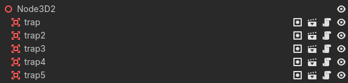

# Trampas (Pinchos)

En este capítulo se describen las trampas o pinchos, que son obstáculos comunes en los videojuegos. Se explicará cómo crear trampas utilizando el motor de juego Godot, en este caso serán los obstáculos que el jugador debe saltar para no perder. Para esto, se creará una nueva escena llamada `spike.tscn` que representará la trampa o pincho en el juego.

En la escena `spike.tscn`, se agregará un nodo `Area3D` como nodo raíz, que es un nodo estático que no se mueve pero puede detectar colisiones. Ahora vamos a crear la siguiente jerarquía.

```
Spike (Area3D)
├── CollisionShape3D
└── MeshInstance3D
```

Para esta jerarquía, seguiremos los siguientes pasos:

1. Haremos click derecho en nuestro nodo raíz (`Area3D`) de la escena `spike.tscn` y seleccionaremos "Add Child Node". Luego, buscaremos `CollisionShape3D` en la lista de nodos disponibles y lo seleccionaremos para agregarlo como hijo del nodo raíz. Esto nos permitirá definir la forma de colisión de la trampa.
2. Repetiremos el proceso para agregar otro nodo hijo de tipo `MeshInstance3D`. Haremos click derecho en el nodo raíz (`Area3D`) nuevamente, seleccionaremos "Add Child Node" y buscaremos `MeshInstance3D` en la lista de nodos disponibles. Luego, lo seleccionaremos para agregarlo como hijo del nodo raíz. Esto nos permitirá renderizar el modelo 3D de la trampa.
3. Para el nodo `CollisionShape3D`, vamos a utilizar una forma de colisión de tipo cilindro para representar la forma del pincho. Para esto, seleccionamos el nodo `CollisionShape3D` y en la propiedad `Shape`, seleccionamos `New CylinderShape3D`. Luego, ajustamos las dimensiones del `CylinderShape3D` para que coincidan con las dimensiones del pincho. Además, en este caso hay que rotar el cilindro para que quede alineado con el pincho. Para hacer esto, selecciona el nodo `CollisionShape3D` y en la propiedad `Rotation`, ajusta los valores para **rotar el cilindro 90 grados en el eje X**. Esto hará que el cilindro esté alineado con el pincho y pueda detectar colisiones correctamente. Modifica las propiedades de la forma de colisión para que tenga una altura de 10 unidades y un radio de 0.5 unidades, lo que coincidirá con la forma del pincho.
4. Para el nodo `MeshInstance3D`, vamos a utilizar una forma de prisma triangular para representar el pincho.  Puedes crear esta forma usando la propiedad de `Mesh` del `MeshInstance3D` y seleccionando `New PrismMesh`. Luego, ajusta las propiedades del `PrismMesh` para obtener la forma deseada. En nuestro caso recomendamos configurar el `PrismMesh`con los siguientes valores: X e Y con 1 unidad y Z con 10 unidades. Esto creará un pincho con profundidad de 10 unidades, lo que lo hace lo suficientemente alto para que el jugador tenga que saltar sobre él.

Tras estos pasos, vamos a tener una escena `spike.tscn` con la jerarquía mencionada y con la forma de colisión y el modelo 3D configurados para representar un pincho o trampa en nuestro juego. Ahora podemos agregar esta escena a la escena principal para crear un grupo de trampas que el jugador pueda saltar.


Ahora vamos a añadir estas trampas a la escena principal; por lo que vamos a ir creando grupos de trampas para que el jugador pueda saltar sobre ellas. Abriremos la escena principal y agregaremos un nodo3D desde el nodo principal, al que llamaremos `Traps`. Este nodo servirá como contenedor para todas las trampas que agreguemos a la escena. Luego, dentro del nodo `Traps`, vamos a agregar varias instancias de la escena `spike.tscn` para crear un grupo de trampas. 


Para agregar una instancia de la escena `spike.tscn`:

1. Simplemente arrastra y suelta el archivo `spike.tscn` desde el panel de archivos al nodo `Traps` en el panel de la escena. Esto creará una instancia de la trampa dentro del nodo `Traps`. 
2. Repite este proceso varias veces para agregar varias trampas a la escena. 


!!! info
    También puedes duplicar cada nodo para no arrastrar siempre; para ello acercate y pulsa <kbd>Ctrl + D</kbd> para duplicar el nodo seleccionado. Luego, ajusta la posición de cada trampa para crear un grupo de trampas que el jugador pueda saltar.

!!! note
    Es recomendable organizar las trampas en diferentes nodos; por ejemplo en grupos de 4 o 5 trampas, para ello crea un `Node3d`como padre de cada grupo y luego añade las trampas como hijos de ese nodo. Esto te permitirá organizar mejor tu escena y facilitar la gestión de las trampas.
    
    


