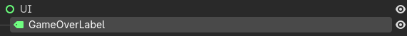
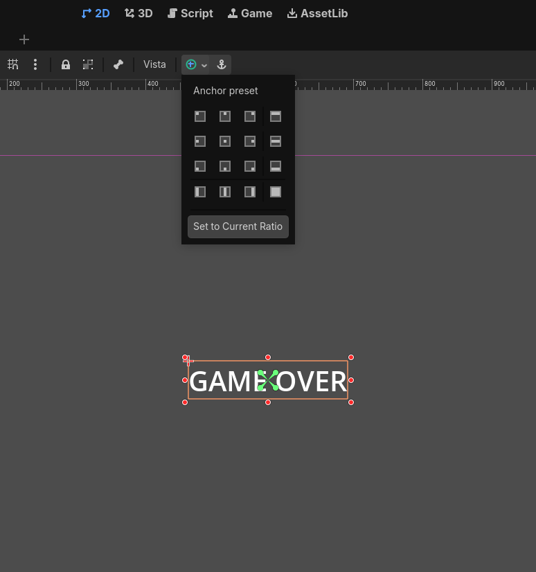
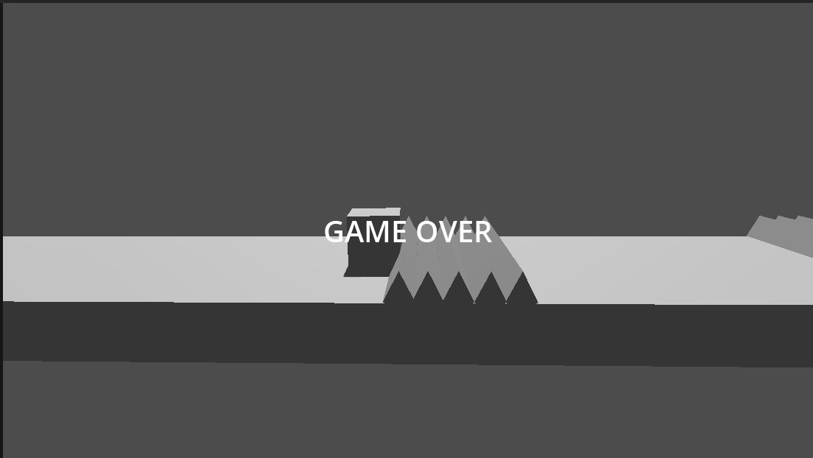

# Mensaje de Fin de Partida (Game Over)

Vamos a mostrar un mensaje de "Game Over" al jugador cuando la partida termine. De esta forma, el jugador sabrá que ha perdido la partida y podrá reiniciar el juego para intentarlo de nuevo. Para esto, vamos a crear una nueva escena que se mostrará cuando el jugador pierda la partida.

## Nodos de control (UI)

Hasta ahora, hemos estado trabajando tanto con nodos 2D (En nuestro Shotemup) como con nodos 3D (En nuestro juego GDash). Sin embargo, para mostrar un mensaje de "Game Over" al jugador, necesitaremos utilizar nodos de control, que son nodos específicos para crear interfaces de usuario (UI) en Godot. Estos nodos nos permiten crear elementos como botones, etiquetas, paneles, etc., que son esenciales para mostrar información al jugador de manera clara y atractiva.

Los nodos de control se enecuentran en la categoría "Control" en el editor de godot; que incluyen muchos nodos útiles para crear interfaces de usuario, como `Label` para mostrar texto, `Button` para crear botones interactivos, `Panel` para organizar elementos de la UI, entre otros. Para mostrar un mensaje de "Game Over", podemos usar un nodo `Label` para mostrar el texto del mensaje u otro tipo de nodo de control que se adapte a nuestras necesidades.

Vamos a añadir a nuestra escena principal un nodo de control para mostrar el mensaje de "Game Over". Para esto, seguiremos los siguientes pasos:

1. Haz clic derecho en el nodo raíz de la escena principal y selecciona `Add Child Node`.
2. En la lista de nodos disponibles, busca `Control` y selecciónalo.
3. Esto agregará un nodo de control a la escena principal. Renombralo a "UI" para mantener una buena organización de la escena.
4. Ahora, haz clic derecho en el nodo "UI" y selecciona `Add Child Node`.
5. En la lista de nodos disponibles, busca `Label` y selecciónalo. Esto agregará un nodo `Label` como hijo del nodo "UI". Renombralo a "GameOverLabel" para identificarlo claramente.

Una vez hecho esto, deberíamos tener la siguiente jerarquía en nuestra escena principal:



Ahora vamos a ponernos manos a la obra para configurar el nodo `Label`para que muestre el mensaje de "Game Over" de manera atractiva. Realizaremos los siguientes pasos:

1. Selecciona el nodo `GameOverLabel` en el panel de la escena.
2. En el panel de propiedades, busca la propiedad `Text` y establece su valor a "Game Over". Esto hará que el nodo `Label` muestre el texto "Game Over" en la pantalla.
3. Para hacer que el mensaje sea más visible, podemos cambiar el tamaño del texto. Para esto, en el panel de propiedades del nodo `GameOverLabel`, busca la sección "Theme Overrides" y busca la sección "Font Sizes". Allí, puedes establecer un tamaño de fuente más grande para que el mensaje sea más visible. Por ejemplo, puedes establecer el tamaño de fuente a 48 o 64 para que el mensaje se destaque en la pantalla.
4. Ahora vamos a colocar en el centro este label para que sea más visible. Para ello, nos ayudaremos de las herramientas del editor de Godot. Selecciona el nodo `GameOverLabel` y luego, en la parte superior del editor, encontrarás las herramientas de alineación. Haz clic en el botón de "Align Center" para centrar el nodo `Label` tanto horizontal como verticalmente en la pantalla. Esto hará que el mensaje de "Game Over" aparezca en el centro de la pantalla, lo que lo hace más visible para el jugador.



## Configurar Script para mostrar el mensaje de Game Over

Ahora vamos a configurar el script de nuestra escena principal para que el mensaje de "Game Over" se muestre cuando el jugador pierda la partida. Para esto, seguiremos los siguientes pasos:

1. Abre el script `main.gd` que creamos anteriormente para manejar la lógica del juego.
2. En el método `_on_game_over()`, vamos a agregar el código para mostrar el mensaje de "Game Over". Para esto, primero necesitamos obtener una referencia al nodo `GameOverLabel` que creamos en la escena. Para esto, podemos usar el método `get_node()` para obtener una referencia al nodo `GameOverLabel`. El código para esto sería el siguiente:

```gdscript
func _on_game_over() -> void:
    $player.started = false
    var game_over_label = $UI/GameOverLabel
    game_over_label.visible = true
```

Si probamos ahora mismo, siempre se mostrará el mensaje de "Game Over" en la pantalla, incluso antes de que el jugador pierda la partida. Esto se debe a que el nodo `GameOverLabel` está visible por defecto. Para solucionar esto, debemos asegurarnos de que el nodo `GameOverLabel` esté oculto al inicio del juego y solo se muestre cuando el jugador pierda la partida.

Para ello añadiremos el siguiente código al método `_ready()` en el script `main.gd` para ocultar el nodo `GameOverLabel` al inicio del juego:

```gdscript
func _ready() -> void:
    for tramp in get_tree().get_nodes_in_group("traps"):
        tramp.connect("body_entered",_on_body_entered)
    $UI/GameOverLabel.visible = false
```

Ahora ya podemos ver como el mensaje de "Game Over" solo se muestra cuando el jugador pierde la partida, es decir, cuando choca con una trampa. Esto hace que el juego sea más interactivo y proporciona una mejor experiencia al jugador, ya que ahora tiene una indicación clara de cuándo ha perdido la partida.

