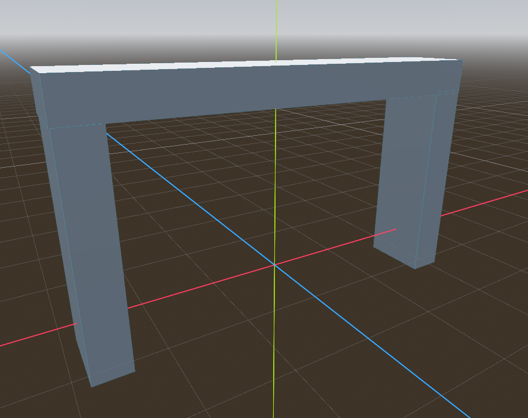
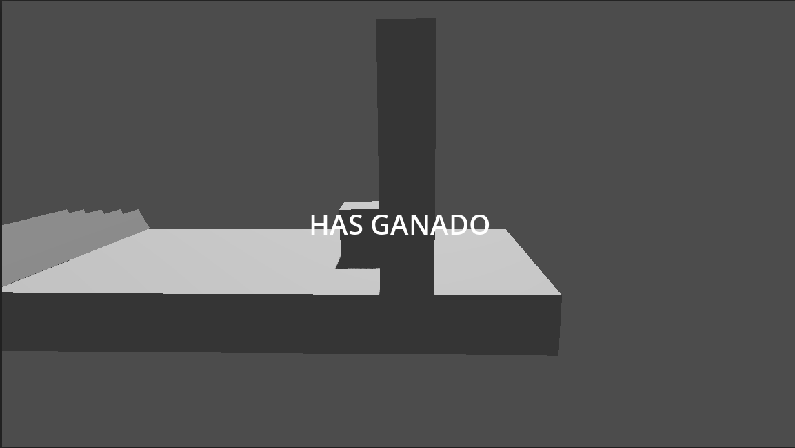

# Ganar la Partida (fin)

Para acabar nuestro juego, vamos a implementar una condición de victoria. Para esto, vamos a crear un nuevo nodo que representará el objetivo que el jugador debe alcanzar para ganar la partida.

En primer lugar, vamos a añadir una nueva escena llamada `end.tscn` que representará el objetivo de la partida. Para crear esta escena, sigue estos pasos:

1. Haz clic derecho en el panel de archivos y selecciona "New Scene".
2. En la nueva escena, agrega un nodo `Node3D` como nodo raíz.
3. Renombra el nodo raíz a "Finish" o cualquier nombre que prefieras.
4. Ahora vamos a añadir 3 `StaticBody3D` como hijos del nodo raíz. Estos nodos representarán el objetivo que el jugador debe alcanzar para ganar la partida. 
5. Para cada `StaticBody3D`, añade un nodo hijo de tipo `CollisionShape3D` para definir la forma de colisión del objetivo. Puedes usar una forma de colisión de tipo caja para representar el objetivo.
6. También añade un nodo hijo de tipo `MeshInstance3D` para darle una apariencia visual al objetivo. Puedes usar una forma de malla de tipo caja para representar el objetivo visualmente
7. Mueve y escala cada uno de los `StaticBody3D` para crear un objetivo que el jugador pueda alcanzar. Por ejemplo, puedes colocar los `StaticBody3D` en diferentes posiciones dentro de la escena para que el jugador tenga que moverse por el escenario para alcanzarlos.

Puedes ver una previsualización de cómo se ve el objetivo en la siguiente imagen:



Además la jerarquía de la escena `end.tscn` debería verse así:

```
End (Node3D)
├── StaticBody3D
│   ├── CollisionShape3D (BoxShape3D)
│   └── MeshInstance3D (BoxMesh)
├── StaticBody3D
│   ├── CollisionShape3D (BoxShape3D)
│   └── MeshInstance3D (BoxMesh)
└── StaticBody3D
    ├── CollisionShape3D (BoxShape3D)
    └── MeshInstance3D (BoxMesh)
``` 

Ahora que tenemos nuestro objetivo creado, vamos a agregarlo a la escena principal. Para esto, simplemente arrastra y suelta el archivo `end.tscn` desde el panel de archivos al panel de la escena principal. Esto creará una instancia del objetivo en la escena principal.

Para acabar de mostrar el área de finalización, vamos a añadir un nuevo nodo de tipo `Area3D` como hijo de nuestro nodo `Finish`. Este nodo se encargará de detectar cuando el jugador entra en el área de finalización para ganar la partida. Para esto, sigue estos pasos:

1. Selecciona el nodo `Finish` en el panel de la escena y haz clic en "Add Child Node".
2. En la lista de nodos disponibles, busca `Area3D` y selecciónalo. Esto agregará un nodo `Area3D` como hijo del nodo `Finish`.
3. Añade un nodo hijo de tipo `CollisionShape3D` al nodo `Area3D` para definir la forma de colisión del área de finalización. Puedes usar una forma de colisión de tipo caja para representar el área de finalización.
4. Ajusta la forma de colisión para que cubra el área alrededor del objetivo. Esto permitirá que el área de finalización detecte cuando el jugador entra en esa área para ganar la partida.

Tras añadir el área la jerarquía del objeto `End`en la escena principal debería verse así:

```
End (Node3D)
├── Area3D
│   └── CollisionShape3D (BoxShape3D)
```

## Condición de Victoria

Ahora que tenemos nuestro objetivo y el área de finalización configurados, vamos a implementar la lógica para detectar cuando el jugador entra en el área de finalización y ganar la partida. Para esto, vamos a agregar un script al nodo principal de la escena principal.

Vamos a modificar el Script `main.gd` para agregar la lógica de victoria. Vamos a conectar la señal `body_entered` del nodo `Area3D` al método `_on_body_entered()`, que se encargará de detectar cuándo el jugador entra en el área de finalización. Si el jugador entra en el área de finalización, emitiremos una señal de victoria que detendrá el movimiento del jugador y mostrará un mensaje de "You Win!" al jugador. Para esto, sigue estos pasos:

1. Selecciona el nodo `Area3D`en la jerarquia de nuestro objeto "finish" y en el panel de señales, conecta la señal `body_entered` al método `_on_finish_area_body_entered()`. Esto nos permitirá detectar cuándo el jugador entra en el área de finalización. El contenido de la función `_on_body_entered()` será el siguiente:

```gdscript

func _on_finish_area_body_entered(body):
    if body.is_in_group("player"):
        game_over.emit()
```

Probamos el juego y saltamos los obstaculos... Pero nos muestra el mensaje de "Game Over" en lugar de felicitar por haber ganado... Esto se debe a que usamos la misma señal `game_over` para indicar tanto la derrota como la victoria. 

Para solucionar esto, vamos a modificar la señal `game_over`para añadir un parámetro que indique si el jugador ha ganado o perdido la partida. Para esto, modificaremos la señal `game_over` de la siguiente manera:

```gdscript
signal game_over(victory: bool)
```

Ahora modificaremos el método de `game_over()` para que reciba el parámetro `victory` y muestre un mensaje diferente dependiendo de si el jugador ha ganado o perdido la partida. El código para esto sería el siguiente:

```gdscript
func _on_game_over(win:bool) -> void:
	$player.started = false
	if not win:
		$UI/GameOverLabel.text = "Game Over"
	else:
		$UI/GameOverLabel.text = "Has Ganado"
	$UI/GameOverLabel.visible = true
```

Ahora solo falta que modifiquemos tanto el método `_on_body_entered()` como el método `_on_finish_area_body_entered()` para que emitan la señal `game_over` con el valor correcto dependiendo de si el jugador ha ganado o perdido la partida. El código para esto sería el siguiente:

```gdscript
func _on_body_entered(body: Node3D) -> void:
	if body.is_in_group("player"):
		game_over.emit(false)

func _on_finish_area_body_entered(body):
    if body.is_in_group("player"):
        game_over.emit(true)
```

De esta forma, ya podremos diferenciar entre la derrota y la victoria en nuestro juego, mostrando un mensaje de "Game Over" cuando el jugador pierda la partida y un mensaje de "Has Ganado" cuando el jugador alcance el área de finalización. Esto hace que el juego sea más interactivo y proporciona una mejor experiencia al jugador, ya que ahora tiene una indicación clara de cuándo ha ganado o perdido la partida.



Con esto hemos terminado nuestro juego, por lo que en la próxima sesión, pasaremos a ver como integrar Realidad Virtual (VR) en Godot y como crear un juego para dicha plataforma.