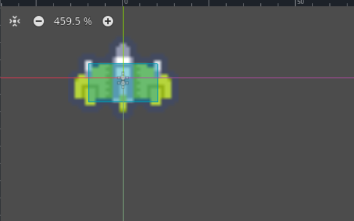

# Jugador

Una vez vista la escena principal, vamos a ver como crear nuestro jugador. En primer lugar, veremos los nodos y la configuración de estos; y posteriormente comenzaremos a ver como mover nuestro jugador con los controles y Scripting.


Vamos a crear una nueva escena llamada `Player`. Recuerda guardar la escena con el nombre ```player.tscn```. El nodo principal de esta escena será un `CharacterBody2D`, que nos permitirá gestionar el movimiento y las colisiones del jugador de forma sencilla en Godot. Este nodo servirá como base para añadir otros nodos necesarios, como sprites, colisionadores y scripts que controlarán el comportamiento del jugador.

## Nodos del jugador

Para configurar los nodos básicos del jugador, sigue estos pasos:

1. **Añadir un nodo Sprite2D**:
    - Haz clic derecho sobre el nodo `CharacterBody2D` y selecciona **Añadir nodo hijo**.
    - Busca y selecciona `Sprite2D`.
    - En el panel de propiedades, asigna la textura que representará al jugador en la propiedad **Texture** (puedes arrastrar una imagen desde el panel de recursos; por ejemplo ```ship_002.png```).
    - Ajusta la propiedad **Offset** si necesitas centrar el sprite respecto al nodo principal.

2. **Añadir un nodo CollisionShape2D**:
    - Haz clic derecho sobre el nodo `CharacterBody2D` y selecciona **Añadir nodo hijo**.
    - Busca y selecciona `CollisionShape2D`.
    - En el panel de propiedades, selecciona una forma para la colisión en la propiedad **Shape** (por ejemplo, `RectangleShape2D`).
    - Ajusta el tamaño y la posición de la forma para que cubra correctamente el sprite del jugador.

La jerarquía de nodos debería verse así:

```
Player (CharacterBody2D)
├── Sprite2D
└── CollisionShape2D
```

Con esto, tu jugador tendrá una representación visual y una forma de colisión básica lista para detectar interacciones en el juego.

