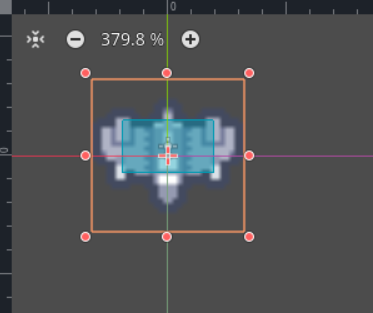

# Enemigo

Ahora vamos a crear el nodo enemigo para posteriormente utilizarlo en la escena principal.

En este caso, vamos a crear una nueva escena llamada ```enemy.tscn```; que contendrá un nodo principal de tipo ```Area2D```; y tendrá un nodo ```Sprite2D``` y un nodo ```CollisionShape2D```.

Para añadir una textura al nodo ```Sprite2D```, selecciona el nodo en el panel de la escena y, en el panel de propiedades, busca la propiedad **Texture**. Haz clic en el icono de carpeta y selecciona la imagen llamada ```ship_0014.png``` desde tu sistema de archivos. Otra propiedad que debemos establecer es la propiedad ```FlipV``` dentro de la categoria ```Offset```.

Para el nodo ```CollisionShape2D```, selecciona el nodo y, en la propiedad **Shape**, haz clic en "empty" y elige la forma que mejor se adapte al contorno de tu enemigo (por ejemplo, **RectangleShape2D** o **CircleShape2D**). Ajusta el tamaño y la posición del área de colisión para que coincida con la imagen del enemigo.



## Script

Vamos a crear un nuevo script para el nodo principal ```Area2D``` haciendo clic derecho sobre el nodo y seleccionando **Attach Script**. Asegúrate de que el script se guarde con el nombre ```enemy.gd``` en la misma carpeta que la escena. Este script te permitirá programar el comportamiento del enemigo, como su movimiento o interacción con otros nodos.

El script contendrá lo siguiente:

```gdscript
@export var speed = 150

func _process(delta: float) -> void:
	position.y += speed*delta
	if position.y > 800:
		queue_free()
```

