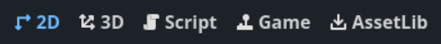
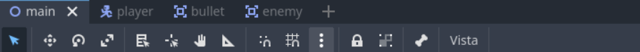
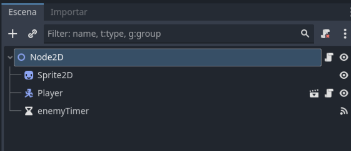
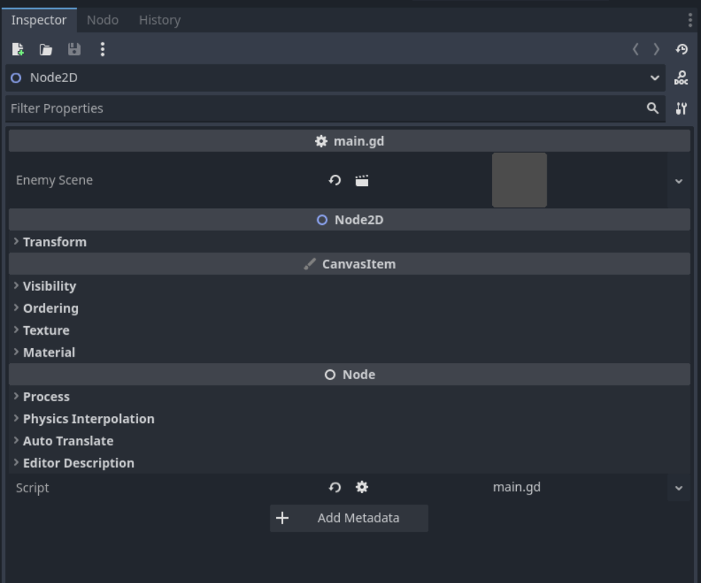
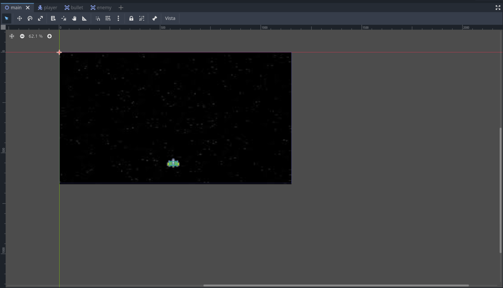
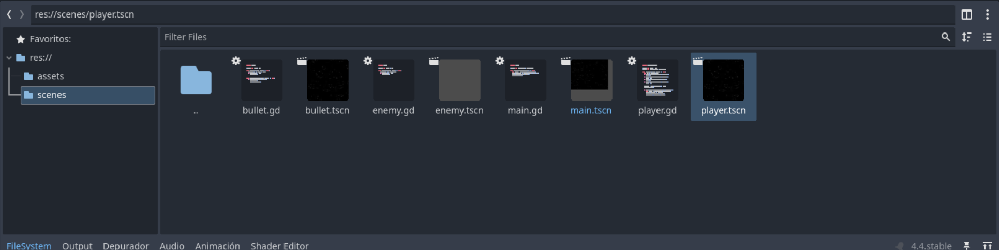
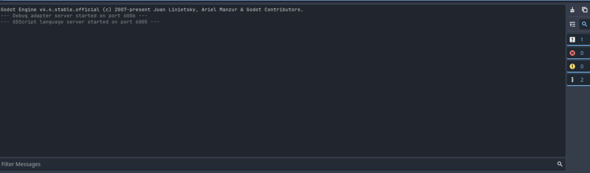

# Interfaz de Godot

## Elementos básicos de la Interfaz de Usuario de Godot

La interfaz de Godot está compuesta por varios paneles y herramientas que facilitan el desarrollo de videojuegos. A continuación se describen los elementos principales:

### 1. Barra de Menú Principal

Contiene opciones como **Archivo**, **Editar**, **Escena**, **Proyecto** y **Ayuda**. Desde aquí se accede a funciones generales del editor.

### 1.1 Modos de la Interfaz

Godot ofrece varios modos de trabajo, accesibles desde la parte superior de la interfaz. Cada modo está diseñado para tareas específicas:

- **2D**: Permite editar escenas y nodos en dos dimensiones, ideal para juegos y aplicaciones 2D.
- **3D**: Proporciona herramientas para trabajar con escenas y objetos tridimensionales.
- **Script**: Abre el editor de scripts para programar la lógica del juego utilizando GDScript o C#.
- **Game**: Ejecuta el juego o escena actual para probar su funcionamiento.
- **AssetLib**: Da acceso a la biblioteca de recursos en línea, donde puedes descargar assets y complementos para tu proyecto.

### 2. Barra de Herramientas

Permite acceder rápidamente a herramientas como mover, rotar, escalar y reproducir la escena.

### 3. Árbol de Escena

Muestra la jerarquía de nodos de la escena actual. Aquí puedes seleccionar, organizar y modificar nodos.

### 4. Inspector

Permite ver y modificar las propiedades del nodo seleccionado.

### 5. Vista Principal

Es el área central donde se visualiza y edita la escena, tanto en 2D como en 3D.

### 6. Panel de Recursos

Muestra los archivos y recursos del proyecto, como scripts, imágenes y escenas.

### 7. Consola de Salida

Muestra mensajes, advertencias y errores generados por el motor o los scripts.

