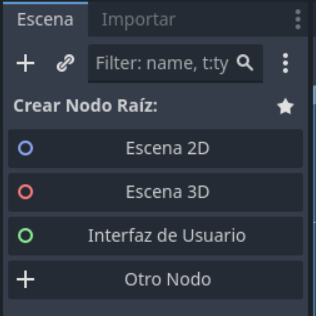
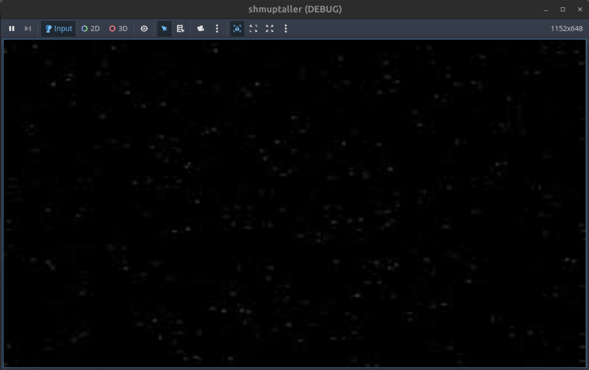

# Escena Principal

La escen principal, será nuestro contenedor donde estarán los elementos del juego e incluso otras escenas. Algunas las crearemos en el propio editor, otras las crearemos en tiempo de ejecución.

Como hemos comentado, las escenas contienen Nodos que pueden ser propios del editor, e incluso otras escenas.

En primer lugar, vamos a crear la escena principal; haciendo click en el menú escena-> Nueva escena.

Nos creará una escena vacia, y en la parte izquierda en el árbol de nodos nos pedirá que seleccionemos el nodo inicial.

Seleccionaremos _Nodo 2D_; para crear como nodo inicial un Nodo 2D; recuerda que puedes trabajar en 2D y 3D pero en este caso nuestro juego será integramente en 2D.



Una vez hecho esto, guardaremos nuestra escena como "main.tscn" usando el menú Escena->Guardar Escena como...

### Añadir nodos

Para añadir nuevos nodos a la escena, asegúrate de tener seleccionado el nodo principal (_Nodo 2D_) en el árbol de nodos. Luego, haz clic en el botón **"+"** que aparece encima del árbol de nodos.

En la ventana de búsqueda que se abre, escribe `Sprite2D` y selecciónalo para añadirlo como hijo del nodo principal. Este nodo te permitirá mostrar imágenes en pantalla, como el personaje o elementos del juego.

Repite el proceso para añadir un nodo `Timer`. Busca `Timer` en la ventana de nodos y añádelo como hijo del nodo principal. El nodo `Timer` te servirá para gestionar eventos temporizados, como contar el tiempo o ejecutar acciones cada cierto intervalo.

Al finalizar, tu árbol de nodos debería verse así:

```
Nodo2D
├── Sprite2D
└── Timer
```

Puedes configurar las propiedades de cada nodo seleccionándolos y usando el panel de propiedades a la derecha.

#### Fondo

Vamos a añadir un fondo para nuestro juego.

Para añadir una imagen de fondo, selecciona el nodo `Sprite2D` que creaste previamente. En el panel de propiedades, busca la propiedad **Texture**. Haz clic en el icono de carpeta junto a **Texture** y selecciona el archivo `space.png` desde tu sistema de archivos o la carpeta de recursos del proyecto.

Esto hará que el nodo `Sprite2D` muestre la imagen `space.png` como fondo de la escena. Puedes ajustar la posición del sprite usando las propiedades de **Transform** si es necesario.

Tu árbol de nodos seguirá igual, pero ahora el nodo `Sprite2D` mostrará la textura seleccionada:

```
Nodo2D
├── Sprite2D (Texture: space.png)
└── Timer
```

### Primera ejecución

Para ejecutar tu juego por primera vez en Godot, haz clic en el botón **Reproducir** (el icono de ▶️ en la esquina superior derecha) o presiona **F5** en tu teclado.

La primera vez que ejecutes el proyecto, Godot te preguntará qué escena quieres usar como principal. Selecciona la escena que acabas de crear y guardar, por ejemplo, `main.tscn`. Haz clic en **Aceptar** para confirmar tu elección.

Godot recordará esta configuración y, a partir de ahora, siempre ejecutará esa escena al iniciar el juego, a menos que cambies la escena principal en la configuración del proyecto.

¡Listo! Ahora deberías ver tu escena principal en ejecución, mostrando el fondo que configuraste.

