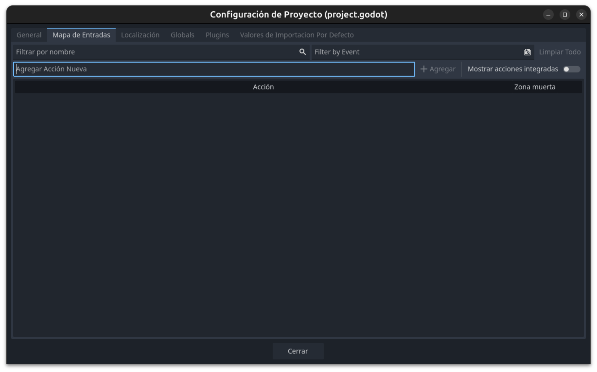

# Movimiento

Vamos a pasar a dar movimiento a nuestro jugador por lo que necesitaremos en primer lugar, establecer los controles de nuestro juego y por otro lado, ya pasaremos a crear nuestro primer Script.

## Mapeo de Controles

En Godot, puedes mapear los controles del juego desde el menú **Proyecto > Configuración del Proyecto > Entrada (Input Map)**. Aquí puedes crear nuevas acciones y asociarlas a teclas específicas del teclado.



Para este caso, debes asegurarte de que las acciones `"ui_right"`, `"ui_left"`, `"ui_up"` y `"ui_down"` estén asociadas a las teclas de dirección del teclado (flechas). Además, la acción `"ui_accept"` debe estar asociada a la barra espaciadora.

1. Abre el menú **Input Map**.
2. Añade las acciones mencionadas si no existen.
3. Haz clic en el botón **Agregar tecla** junto a cada acción y selecciona la tecla correspondiente:
    - `"ui_right"`: Flecha derecha
    - `"ui_left"`: Flecha izquierda
    - `"ui_up"`: Flecha arriba
    - `"ui_down"`: Flecha abajo
    - `"ui_accept"`: Barra espaciadora

De esta forma, tu juego responderá a los controles básicos de movimiento y acción.

## Script Movimiento

Ya podemos comenzar a crear el código de nuestro juego. Para ello vamos a comenzar a crear un script para la escena jugador; asociado al nodo principal.

### Añadir un Script al Nodo Player

Vamos a asociar un script al nodo `Player` de tipo `CharacterBody2D` que creamos en la escena `Player`, sigue estos pasos:

1. Selecciona el nodo `Player` en el panel de la escena.
2. Haz clic en el botón **Adjuntar script** (ícono de hoja con un signo "+") en la parte superior del editor.
3. En la ventana que aparece, asegúrate de que el campo **Inherit** esté configurado como `CharacterBody2D`.
4. Elige la ubicación y el nombre del archivo del script (por ejemplo, `player.gd`).
5. Haz clic en **Crear**.

Esto creará y asociará un nuevo script al nodo `Player`. Ahora puedes comenzar a programar el comportamiento del jugador dentro de este script.

Ahora podemos ir al modo Script (en la parte superior), para trabajar con _GDScript_.

### GDScript

GDScript es el lenguaje de programación principal de Godot, diseñado específicamente para facilitar el desarrollo de videojuegos. Es un lenguaje de alto nivel, dinámico y con una sintaxis similar a Python, lo que lo hace fácil de aprender y utilizar.

#### Características principales de GDScript

- **Sintaxis sencilla:** Inspirada en Python, lo que permite escribir código de forma clara y concisa.
- **Integración total con Godot:** Permite acceder y manipular todos los nodos, señales y recursos del motor de manera directa.
- **Tipado dinámico (opcionalmente estático):** Puedes declarar variables sin especificar su tipo, aunque también es posible usar tipado estático para mayor seguridad.
- **Alto rendimiento:** Está optimizado para funcionar eficientemente dentro del motor Godot.
- **Soporte para señales:** Facilita la comunicación entre nodos mediante el sistema de señales propio de Godot.

GDScript es ideal para scripts de lógica de juego, control de escenas, animaciones y cualquier funcionalidad personalizada que requiera tu proyecto.

Vamos a crear nuestro primer Script; verás que en la pantalla aparece:

```gdscript
extends CharacterBody2D
```

Esto indica que extiende de ese tipo de nodo (que corresponde al nodo principal asociado a este script).

Vamos a escribir el siguiente fragmento.

```gdscript

@export var speed = 300

func  _process(delta: float) -> void:
	var dir = Vector2.ZERO
	if Input.is_action_pressed("ui_right"):
		dir.x+=1
	if Input.is_action_pressed("ui_left"):
		dir.x -=1
	if Input.is_action_pressed("ui_up"):
		dir.y-=1
	if Input.is_action_pressed("ui_down"):
		dir.y +=1
		
	velocity = dir.normalized()* speed
	move_and_slide()

```

!!! warning
    **Cuidado!!** al igual que otros lenguajes de script como python, gdscript utiliza tabulaciones o espacios para indentar y gestionar el código por lo que ten cuidado al copiar y pegar.


## Instanciar Escena

Otra de las características de Godot es el poder usar nodos como escenas instanciadas. Vamos a añadir una escena ```player``` a la escena ```jugador```.

Sigue estos pasos:

1. Abre la escena `main` en el editor de Godot.
2. Haz clic en el botón **Instanciar escena** (ícono de cadena o enlace) en la parte superior del panel de la escena.
3. Selecciona la escena `player.tscn` y haz clic en **Abrir**.
4. Verás que el nodo `Player` aparece como hijo en el árbol de nodos de la escena `main`.
5. Ajusta la posición del nodo `Player` si es necesario, usando las herramientas de mover en el editor.

De esta forma, el jugador estará presente en la escena principal y podrás controlar su movimiento cuando ejecutes el juego.

Ya podemos probar nuestro juego y ver como la nave se mueve.