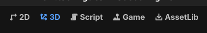

# Nodos 3D vs Nodos 2D

En esta sección, compararemos los nodos utilizados en escenas 3D con los nodos utilizados en escenas 2D en Godot. Esto te ayudará a entender las diferencias y similitudes entre ambos tipos de nodos, así como a elegir el nodo adecuado para tus proyectos.

Recuerda que en Godot, los nodos son los bloques de construcción básicos de tus escenas. Para trabajar con gráficos 3D, es importante entender los diferentes tipos de nodos que puedes usar.

Mientras que en escenas 2D, los nodos comunes incluyen ```Sprite```, ```AnimatedSprite```, ```TileMap``` y ```CollisionShape2D```, en escenas 3D, los nodos comunes incluyen ```MeshInstance3D```, ```Light3D``` y ```Camera3D```.

Es importante mencionar que para poder trabajar con nodos 3D, es necesario tanto tener una comprensión de las diferentes coordenadas (``x``, ``y``, ``z``) y conceptos relacionados con el espacio 3D. También mencionar que necesitas trabajar con luces y cámaras para poder visualizar tu escena 3D, mientras que en escenas 2D, la cámara es opcional.

Recuerda que para el editor godot pueda trabajar en 3D, necesitarás trabajar en el modo 3D del editor que puedes encontrar en la parte superior del editor. Esto te permitirá manipular objetos en el espacio 3D y configurar las propiedades de los nodos 3D de manera adecuada.



Durante esta sección, veremos los diferentes nodos utilizados en escenas 3D y cómo se comparan con los nodos utilizados en escenas 2D. Es por ello, que es importante entender las diferencias entre ambos tipos de nodos para poder elegir el nodo adecuado para tu proyecto y crear escenas atractivas y funcionales.

