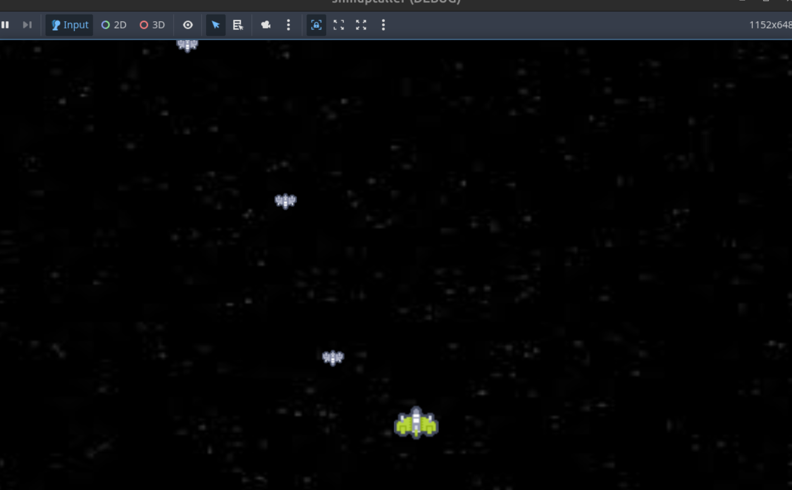

# SHot Em Up

En este apartado, ya vamos a comenzar a ver como realizar nuestro juego; para este taller, vamos a crear un shot'emup clásico (MataMarcianos); este juego tendrá los elementos clásicos de este tipo de juegos.

!!! info
    Puedes encontrar los recursos que vamos a necesitar para nuestro juego en el siguiente enlace:
    [Recursos Juego](assets/shotemup_resources.zip). Descomprime estos ficheros dentro de la carpeta de nuestro proyecto.

Veamos nuestro juego:

Podemos ver en la captura, algunos elementos de un juego de este tipo:

* **Jugador**: La nave del jugador que es la que controlaremos.
* **Enemigo**: Una o varias naves enemigas que van a por nosotros.
* **Disparos**: Aunque no se muestra en la pantalla, vamos a necesitar disparar balas para acabar con las naves enemigas por lo tanto necesitarmeos añadir uno o varios disparos.

Cada uno de estos elementos es en si mismo una escena del juego; además de añadir una escena contenedora de estos llamada escena principal.

Por lo tanto, nuestro juego necesitará crear las siguientes escenas:

* **Jugador**: Que controlará el jugador de este juego.
* **Enemigo**: tendrá todos los elementos necesarios para gestionar un enemigo.
* **Disparo**: Cada disparo que realice el jugador para acabar con los enemigos.
* **Main**: Es la escena principal que contendrá las instancias de las otras escenas u otros nodos.

Cada escena, contendrá uno o varios nodos y tendrá asociados diferentes scripts.