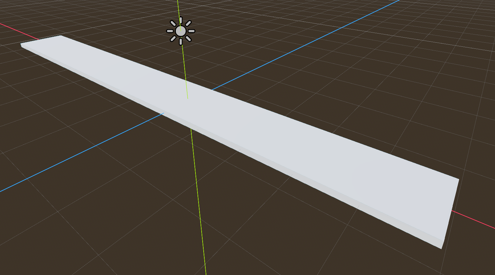

# Terreno

Vamos a comenzar a crear un pequeño suelo para nuestro juego. Para ello, utilizaremos un nodo ```StaticBody3D``` como base para nuestro terreno, ya que este tipo de nodo es ideal para objetos que no necesitan moverse pero sí interactuar con la física del juego.

En este caso crearemos un nodo ```StaticBody3D``` y lo nombraremos "Ground". Después añadiremos un nodo hijo de tipo ```CollisionShape3D``` para definir la forma de colisión del terreno. Para esto, seleccionamos el nodo "Ground", hacemos clic en "Add Child Node" y buscamos "CollisionShape3D". Luego, asignamos una forma de colisión adecuada, como un ```BoxShape3D```, para representar el suelo.

También añadiremos un nodo hijo de tipo ```MeshInstance3D``` para darle una apariencia visual al terreno. Para esto, seleccionamos el nodo "Ground", hacemos clic en "Add Child Node" y buscamos "MeshInstance3D". Luego, asignamos una malla adecuada, como un ```BoxMesh```, para representar el suelo visualmente. 

Después de esto la estructura de nuestro nodo "Ground" debería verse así:

```
Ground (StaticBody3D)
├── CollisionShape3D (BoxShape3D)
└── MeshInstance3D (BoxMesh)
```


Vamos a ajustar el tamaño tanto de la forma de colisión como de la malla para que se adapte a nuestras necesidades. Para ello, seleccionamos en primer lugar el nodo "CollisionShape3D" y ajustamos las dimensiones del ```BoxShape3D``` (haciendo click en la forma de colisión) para que tenga un tamaño adecuado para nuestro terreno. Luego, seleccionamos el nodo "MeshInstance3D" y ajustamos las dimensiones del ```BoxMesh``` para que coincida con la forma de colisión. Para nuestro ejemplo estableceremos un tamaño de 100 unidades para el eje X, para el eje Z 10 unidades y para el eje Y 1 unidad, lo que nos dará un terreno plano y amplio para trabajar.

Una vez hecho esto, ya podremos ver nuestro terreno en la escena. Podemos movernos por el espacio 3D para observar cómo se ve desde diferentes ángulos y asegurarnos de que todo esté correctamente alineado. Además, podemos ajustar la posición del nodo "Ground" para colocarlo en el lugar deseado dentro de nuestra escena.

