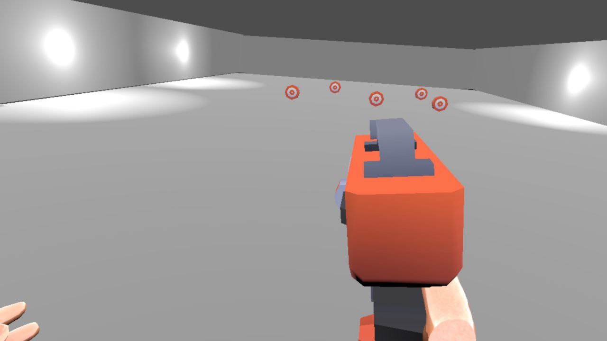

# Juego VR (Shooter Volter)

Para nuestro ejemplo de juego de VR, vamos a crear un shooter en el que el jugador tendrá que disparar a unos objetivos que aparecerán en la escena. Para ello, vamos a utilizar el proyecto de ejemplo que hemos creado en la sección de _Instalación y Configuración_ de este curso, y lo adaptaremos para crear nuestro juego de VR.

Nuestro juego que llamaremos "Shooter Volter" consistirá en una escena en la que aparecerán unos objetivos que el jugador tendrá que disparar utilizando un arma. Para ello, utilizaremos las herramientas de VR de Godot para crear una experiencia inmersiva y divertida para el jugador.

Para este juego, nos centraremos en la creación del escenario y la inclusión de modelos externos que incluiremos en nuestra escena. Para ello, utilizaremos el formato de archivo .fbx, que es un formato de archivo 3D que es compatible con Godot y que nos permitirá importar modelos 3D de forma sencilla.

<video autoplay loop muted>
  <source src="/video/video_vr.mp4" type="video/mp4" >
  Your browser does not support the video tag.
</video>