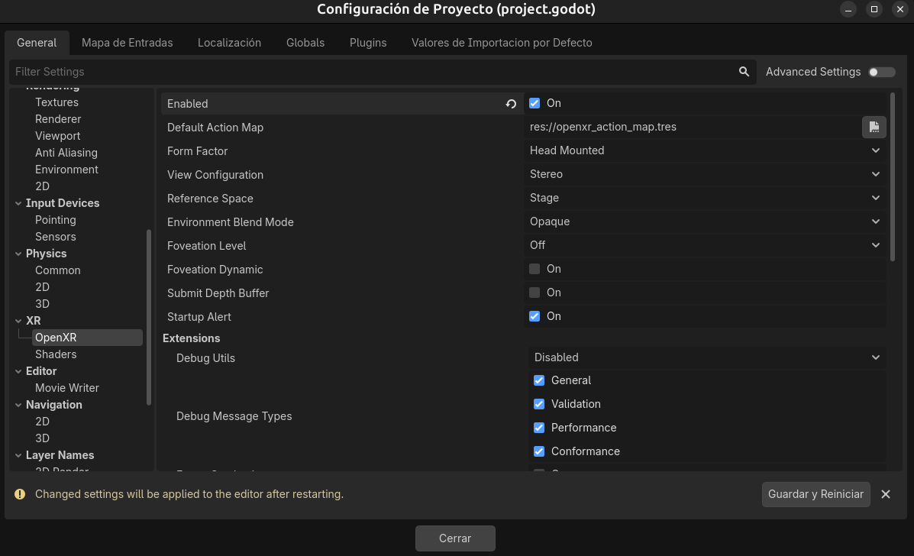
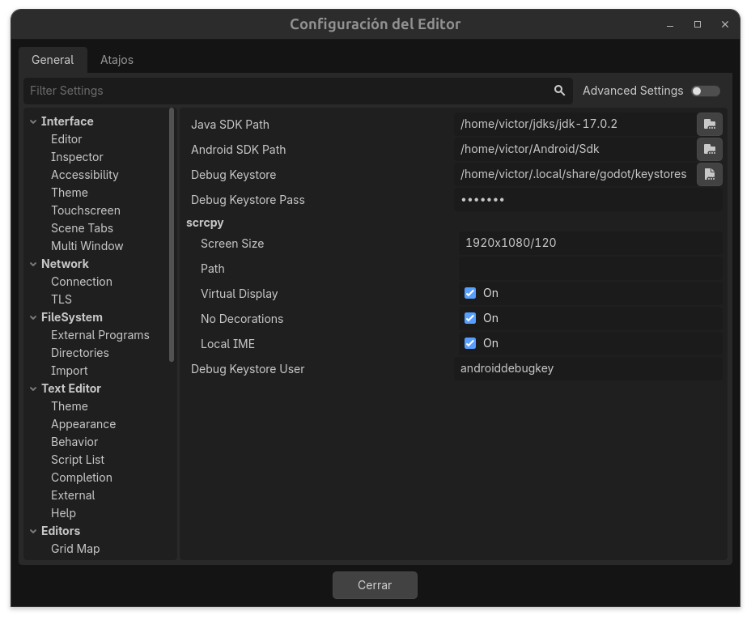
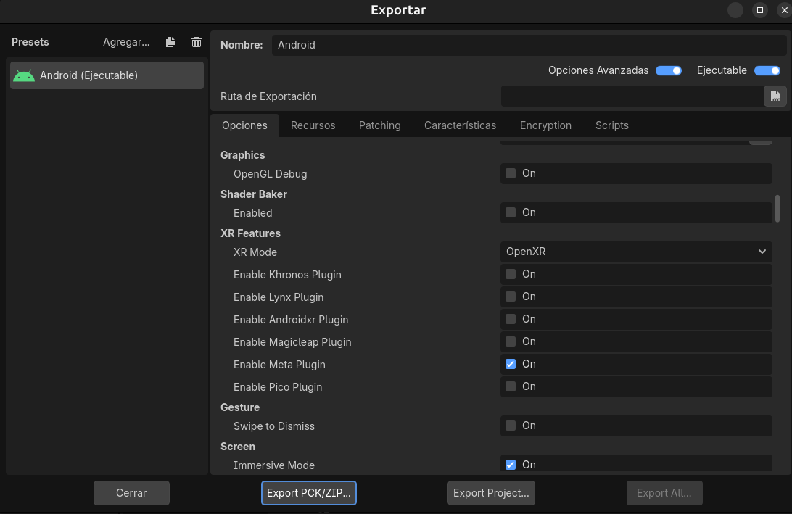
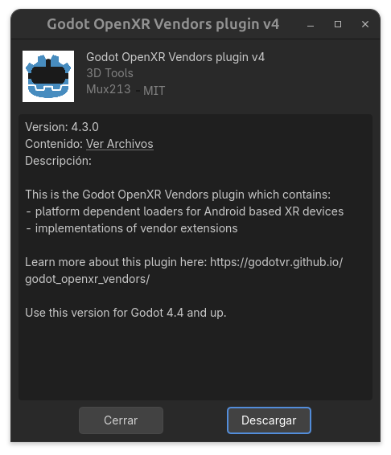
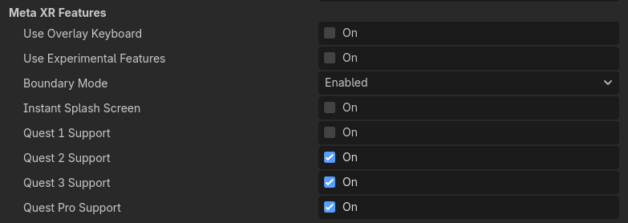

# Instalación y Configuración de VR en Godot

En esta sección, vamos a instalar y configurar todo lo necesario para desarrollar experiencias de realidad Virtual (VR) en Godot.

Comenzaremos creando un nuevo proyecto en Godot; el cual crearemos como hemos hecho en otras secciones, le pondremos el nombre que queramos y lo guardaremos en la ubicación que prefiramos. Una vez creado el proyecto, lo abriremos para empezar a configurar el soporte de VR.

!!! Note
    Dependiendo del dispositivo a utilizar recomendamos que como renderizador se utilice o **mobile** o **compatibility**; para nuestro caso usaremos este último ya que es compatible con el dispositivo VR que vamos a utilizar (Meta Quest 2).

Comenzaremos por activar las opciones de VR en nuestro proyecto. Para ello, iremos a **Project > Project Settings > XR** y activaremos la opción **Enable XR**. Esto habilitará el soporte de VR en nuestro proyecto.

Como vemos en la anterior figura, tenemos que reiniciar el proyecto para que los cambios surtan efecto. Una vez reiniciado, volveremos a la sección de **XR** en las opciones del proyecto y veremos que ahora tenemos una nueva opción llamada **OpenXR**. Aquí es donde seleccionaremos la API de VR que queremos utilizar.

Ahora, vamos a activar los shaders para XR. Para ello, iremos a **Project > Project Settings > XR > Shaders** y activaremos la opción **Enable**, y volvemos a reiniciar el proyecto. Esto permitirá que los shaders de nuestro proyecto sean compatibles con VR.

No olvides activar las opciones de Desarrollo en tu dispositivo VR, ya que esto es necesario para poder probar tus aplicaciones de VR en el dispositivo. Para ello, sigue las instrucciones específicas para tu dispositivo VR para activar el modo de desarrollo.

## Despliegue en Android

Para continuar, vamos a configurar nuestro proyecto para desplegarlo en Android, ya que el dispositivo VR que vamos a utilizar (Meta Quest 2) es compatible con esta plataforma. Para ello, iremos a **Proyecto > Instalar plantilla de Configuración de Android** y seguiremos las instrucciones para instalar la plantilla de construcción de Android en nuestro proyecto.

Ahora, vamos a instalar las herramientas de desarrollo para Android necesarias; necesitaremos:

* OpenJDK 11 o superior.
* Android SDK.
* Android NDK.

Todos estos componentes se pueden instalar a través de _Android Studio_, que es la forma más sencilla de obtenerlos. Una vez instalado Android Studio, abrelo y ve a **Configure > SDK Manager** para instalar el SDK y el NDK. Asegúrate de instalar la versión del NDK que sea compatible con tu versión de Godot.

Ahora añadiremos la exportación para Android en nuestro proyecto. Para ello, iremos a **Project > Export** y añadiremos una nueva configuración de exportación para Android. 

Podrás observar un error al añadir esta configuración; debido a que no se encuentran las rutas de OpenJDK y Android SDK. Para solucionar esto, iremos a **Editor > Editor Settings > Export > Android** y configuraremos las rutas de OpenJDK y Android SDK según la ubicación donde los hayas instalado en tu sistema.

!!! warning
    Podrás observar un mensaje de aviso que se requieren las texturas ETC2 para Android. Esto se debe a que Android requiere que las texturas estén en un formato específico para ser compatibles con VR. Para solucionar esto, iremos a **Project > Project Settings > Rendering > Quality** y activaremos la opción **ETC2 Textures**. Esto asegurará que nuestras texturas sean compatibles con Android y VR.

También es importante activar la opción de **Gradle Build** en la configuración de exportación para Android, ya que esto facilitará el proceso de construcción y despliegue de nuestra aplicación en el dispositivo VR.

Para acabar, en el apartado **XR Features** seleccionaremos la opción **OpenXR** para asegurarnos de que nuestra aplicación sea compatible con el dispositivo VR que vamos a utilizar.

Para activar las opciones propias de Meta Quest, activa la opción de **Enable Meta Plugin**. Esto asegurará que tu aplicación sea compatible con las gafas de realidad virtual Meta Quest y pueda aprovechar sus características específicas.

### Instalación del Plugin para OpenXR

Para continuar, vamos a instalar el plugin para OpenXR en nuestro proyecto. Para ello, iremos a **AssetLib** y buscaremos el plugin de _OpenXR Vendors Plugin V4_ para Godot. Una vez encontrado, lo instalaremos en nuestro proyecto, pulsando descargar, y posteriormente el botón de instalar.

!!! note
    Puedes encontrar el plugin de OpenXR en el siguiente enlace: [OpenXR Vendors Plugin V4](https://github.com/GodotVR/godot_openxr_vendors/releases) e Instalarlo manualmente descargando el archivo .zip y extrayéndolo en la carpeta de tu proyecto.

Ahora, vamos a activar las opciones concretas para nuestro dispositivo VR (Meta Quest 2) en el plugin de OpenXR. Para ello, iremos a **Project > Export...** y activaremos las siguientes opciones en la configuración de exportación para Android:

* **Quest 1, 2, 3 Support**: Esta opción habilita el soporte específico para las gafas de realidad virtual Meta Quest 1, 2 y 3, lo que garantiza que tu aplicación sea compatible con estas gafas y pueda aprovechar sus características específicas.

!!! note
    Aunque a partir de la versión 4.6 de Godot ya no es necesario, es recomendable usar este plugin para ver las opciones concretas para cada dispositivo VR y asegurarnos de que nuestra aplicación sea compatible con el dispositivo que estamos utilizando para desarrollar nuestras experiencias de VR.

## Desplegar en el dispositivo VR

Para desplegar en el dispositivo VR, conectaremos nuestro dispositivo Meta Quest 2 a nuestro ordenador mediante un cable USB. Asegúrate de que el dispositivo esté en modo de desarrollo y que hayas aceptado la conexión desde el dispositivo.

!!! info
    Puede ser necesario que necesites modificar el espacio de color; para ello, ve a las opciones del proyecto y en la sección de **Open XR** selecciona el espacio de color **RC709**. Esto asegurará que los colores se muestren correctamente en el dispositivo VR.

Para instalar la aplicación en el dispositivo VR, basta con pulsar la opción de **Remote Deploy** (Activa la opción de **Monitor Android Devices**) en la parte superior derecha del editor de Godot, seleccionar la configuración de exportación para Android que hemos creado anteriormente y pulsar el botón de desplegar. Esto compilará tu aplicación y la instalará en el dispositivo VR para que puedas probarla.

!!! note
    Puede que necesites instalar los controladores USB específicos para tu dispositivo VR para que sea detectado por ADB Puedes encontrar más información sobre cómo instalar los controladores USB para tu dispositivo VR en la [documentación oficial del fabricante](https://developers.meta.com/horizon/documentation/native/android/mobile-device-setup/).

!!! warning
    Puede que ocurra un error a la hora de ejecutar la aplicación en el dispositivo VR; no te preocupes puedes encontrar tu aplicación en el dispositivo VR en el apartado de "Unknown Sources" o "Fuentes desconocidas". Esto se debe a que la aplicación no está firmada con una clave de firma válida, lo cual es necesario para instalar aplicaciones en dispositivos Android. Para solucionar esto, puedes generar una clave de firma utilizando Android Studio y configurar tu proyecto de Godot para usar esa clave de firma al exportar tu aplicación para Android. Esto permitirá que tu aplicación sea instalada correctamente en el dispositivo VR sin mostrar el error de "Unknown Sources".