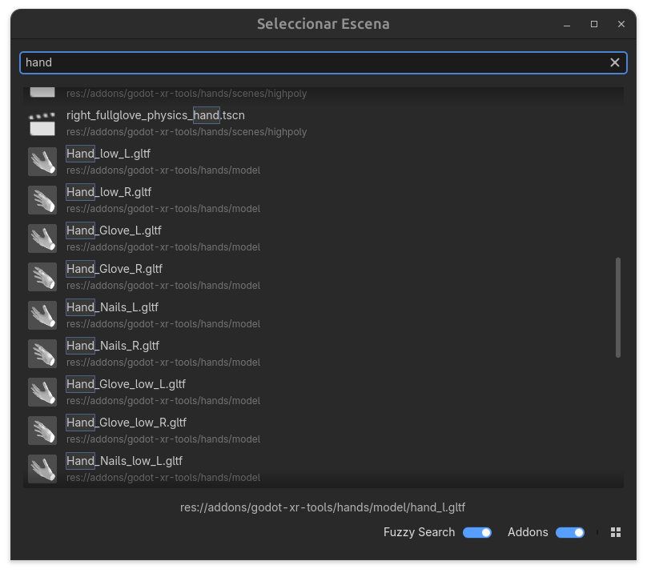
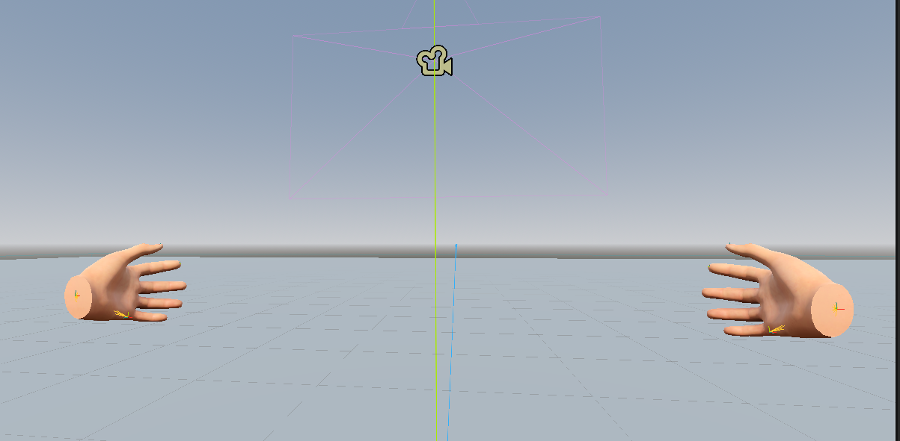
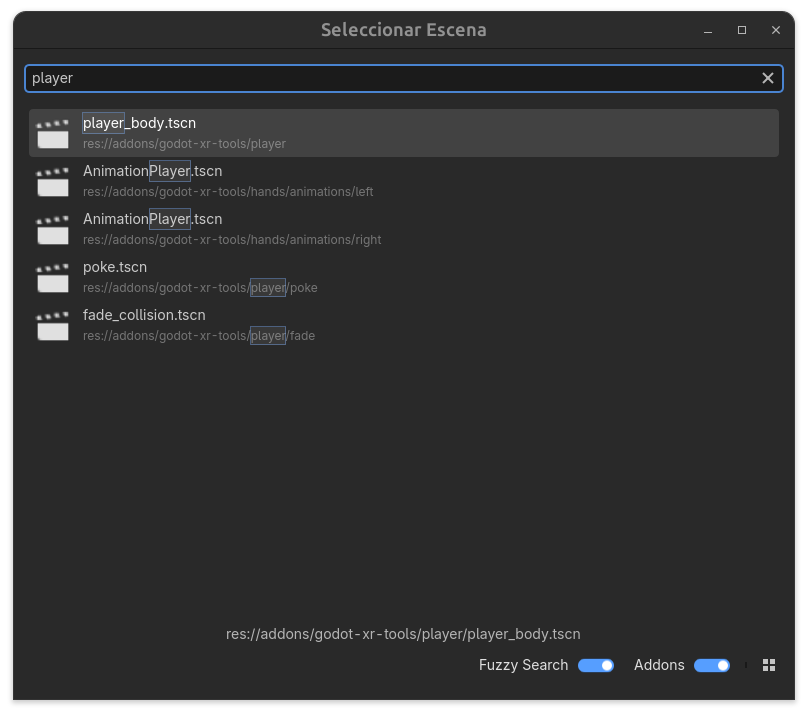

# Interacción en VR

En esta sección, vamos a explorar cómo implementar la interacción en VR utilizando Godot. La interacción en VR es fundamental para crear experiencias inmersivas y atractivas, ya que permite a los usuarios interactuar con el entorno virtual de manera natural y fluida.

En la anterior sección, hemos instalado un plugin llamado **Godot XR Vendors Plugin V4** que nos permite utilizar OpenXR en nuestro proyecto de Godot. Este plugin es esencial para habilitar la compatibilidad con una amplia gama de dispositivos VR, incluyendo las gafas Meta Quest 2 que estamos utilizando para este curso.

Para esta sección, vamos a añadir un nuevo plugin que añade más funcionalidad y formas de moverse e interactuar con el entorno; este plugin se llamada **Godot XR Tools** y lo puedes encontrar en el siguiente enlace: [Godot XR Tools](https://github.com/GodotVR/godot-xr-tools/releases) y lo instalaremos en nuestro proyecto, pulsando descargar, y posteriormente el botón de instalar. (En nuestro caso la versión Quest).

!!! info
    Para instalarlo manualmente, puedes descargar el archivo .zip desde el enlace anterior y extraerlo en la carpeta de tu proyecto de Godot. en la carpeta **addons** de tu proyecto. Puede dar algunos errores pero no nos debería afectar a la funcionalidad del plugin. También debes activar el plugin en **Project > Project Settings > Plugins** y activar la opción **Godot XR Tools** para que el plugin esté activo en tu proyecto. Una vez hecho esto, ya podemos utilizar las funcionalidades que nos ofrece este plugin para implementar la interacción en VR en nuestra escena.

Una vez descargado e instalado el plugin, vamos a modificar la escena que hemos creado en la sección de primeros pasos con VR para añadir algunos nodos adicionales que nos permitirán implementar la interacción en VR. Para ello, añadiremos los siguientes nodos a nuestra escena.

Comenzaremos añadiendo un suelo; añadimos al nodo raíz un nodo de tipo **StaticBody3D** y lo renombraremos a "Floor". Este nodo representará el suelo de nuestra escena de VR y permitirá que los objetos interactúen con él de manera física. Para darle forma al suelo, añadiremos un nodo hijo de tipo **CollisionShape3D** y otro nodo hijo de tipo **MeshInstance3D**. En el nodo CollisionShape3D; le daremos forma de un plano utilizando un **BoxShape3D** con tamaño (60.0,0.5,60.0) y en el nodo MeshInstance3D; le daremos forma de un plano utilizando un **PlaneMesh**. Esto creará un suelo plano en nuestra escena de VR.

## Manos

Ahora vamos a añadir un modelo de manos a nuestro proyecto. Para ello, vamos a utilizar un modelo de manos que se encuentra en el Plugin de Godot XR Tools. Para ello, vamos a añadir una escena instanciada que encontraremos en nuestro proyecto en la ruta **res://addons/godot_xr_tools/Scenes/Hand_r.tscn**. Esta escena contiene un modelo de manos que se puede utilizar para representar las manos del usuario en VR.

Recuerda que tienes que añadir ambas manos a cada uno de los controladores. Quedando la escena más o menos así:

## Jugador

Vamos a añadir funcionalidad a nuestro jugador para que pueda moverse e interactual con el entorno VR. Para ello, vamos a instanciar una escena que provee el plugin de Godot XR Tools, esta escena se llama **Player_body.tscn** que añadiremos como hijo del nodo **XROrigin**. Veremos que esta escena necesita un CollisionShape3D para funcionar correctamente, así que añadiremos un nodo hijo de tipo **CollisionShape3D** a la escena del jugador y le daremos forma de un cilindro utilizando un **CapsuleShape3D** La cual moveremos para que este correctamente colocada.

### Movimiento del Jugador

Para acabar esta sección, vamos a añadir la funcionalidad de movimiento y giro a nuestros controladores. 

Comenzaremos por el movimiento; para ello, vamos a añadir una nueva escena a nuestro nodo del controlador izquierdo. Añadiremos una escena instanciada llamada **move_direct.tscn**. Esto añadirá la posibilidad de movimiento.

También añadiremos la funcionalidad de giro; para ello, vamos a añadir otra escena al controlador derecho llamada **move_turn.tscn**. Esto añadirá la posibilidad de giro.

!!! note
    Por defecto el movimiento se realiza "por pasos"; por lo que podemos hacer que el giro sea más suave activando la opción de "smooth" en la propiedad mode del nodo move_turn. Esto hará que el giro sea más suave y fluido, lo que puede mejorar la experiencia de VR para algunos usuarios.

También podemos añadir otras funcionalidades como la de teletransporte, para ello, añadiremos la escena **teleport.tscn** a uno de los controladores. Esto añadirá la posibilidad de teletransporte a nuestra escena de VR.

!!! info
    Puedes encontrar otros movimientos y funcionalidades en el plugin de Godot XR Tools, como por ejemplo el movimiento de deslizamiento, el movimiento de giro suave, la interacción con objetos, entre otros. Puedes explorar el plugin para encontrar la funcionalidad que mejor se adapte a tu proyecto de VR.

Una vez hecho esto, ya podemos probar nuestra escena de VR para ver cómo se siente la interacción en VR utilizando Godot. Recuerda que para probarlo necesitarás tener tu dispositivo VR configurado y conectado a tu ordenador, y asegurarte de que las opciones de VR estén habilitadas en tu proyecto de Godot.