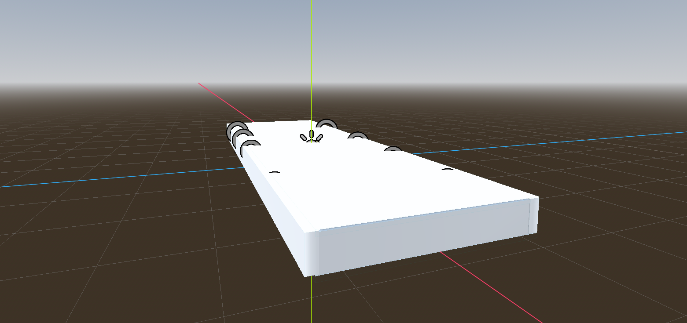

# Entorno (Room)

En primer lugar, vamos a añadir a nuestra escena principal la habitación en la que se desarrollará nuestro juego de VR. Para ello, vamos a utilizar la escena que hemos importado en la sección de _Importar Recursos_, que contiene una habitación con iluminación.

Para añadir la habitación a nuestra escena principal, basta con arrastrar y soltar el archivo room.tscn de la habitación en el editor de Godot. Esto añadirá automáticamente la habitación a nuestra escena principal, y podremos abrirla para editarla y adaptarla a nuestro juego de VR.

Podemos mover la habitación a la posición que queramos en nuestra escena principal, y ajustar su escala si es necesario para que se adapte a nuestro juego de VR. Además, podemos editar la iluminación de la habitación para darle un aspecto más realista y adecuado para nuestro juego de VR.

Recuerda que nuestro objeto _XROrigin_ es el que representa la posición del jugador; y por lo tanto, es importante que la habitación esté posicionada de manera adecuada en relación a nuestro objeto XROrigin para que el jugador pueda moverse y explorar la habitación de manera cómoda y natural en VR.

Si ahora pruebas la aplicación en tu dispositivo VR, podrás ver que la habitación se muestra correctamente y que puedes moverte por ella utilizando las herramientas de VR de Godot. Esto nos proporciona un entorno básico para nuestro juego de VR, y a partir de aquí podemos empezar a añadir los objetivos y el arma para crear nuestro juego de shooter en VR.