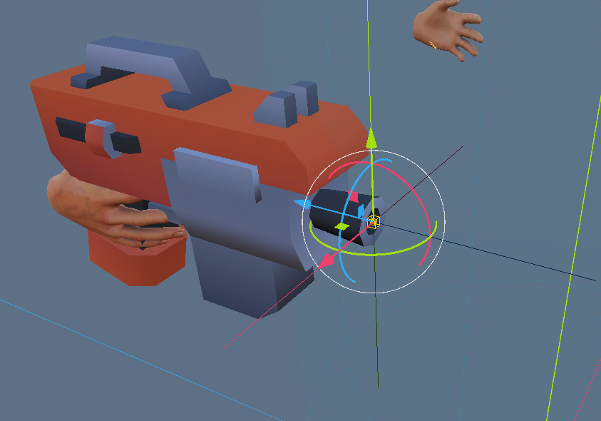

# Disparos (Shots)

Para acabar, vamos a hacer que nuestra arma dispare balas. En nuestro caso, vamos a usar una nueva escena para representar la bala, y cada vez que disparemos, se instanciará una nueva bala que se moverá hacia adelante.

## Creando la escena de la bala

1. Crea una escena y guardala con el nombre "Bullet.tscn".
2. Crea una nueva escena y añádele un nodo **CharacterBody3D**. Nómbralo "Bullet".
3. Añáde como nodo hijo un **CollisionShape3D** con una forma de boxShape.
4. Arrastra el modelo de bala llamado **bullet-foam-lip.fbx** a la escena y hazlo hijo del nodo "Bullet". Ajusta su posición y escala para que se vea bien.
5. Vamos a rotar 90 grados tanto el **CollisionShape3D** como el modelo de la bala para que apunten hacia adelante. Para ello, selecciona ambos nodos y en el inspector, ajusta la rotación a (0, 0, -90).
6. Añáde un nuevo script a la escena de la bala y llámalo "Bullet.gd". Abre el script y reemplaza su contenido con el siguiente código:

```gdscript
extends CharacterBody3D

@export var speed: float = 20.0

func _process(delta):
	# Mueve la bala hacia adelante en su eje Z local
	position += transform.basis * Vector3(0, 0, -speed) * delta
```
Este script hace que la bala se mueva hacia adelante a una velocidad constante. La dirección de movimiento se determina por la orientación de la bala, lo que nos permitirá disparar en la dirección en la que el arma esté apuntando.

## Disparando la bala

Una vez tenemos nuestra escena de la bala, vamos a modificar la escena principal; donde se encuentra nuestra arma, para que dispare una bala cada vez que presionemos el botón de disparo.

En primer lugar, necesitaremos una referencia en el arma para saber desde donde va a salir la bala. Por lo que crearemos un nuevo nodo **Marker3D** como hijo del nodo "Gun" y lo nombraremos "Muzzle". Este nodo representará la boca del cañón de nuestra arma, y será el punto desde donde se instanciarán las balas.

No olvides ajustar la posición del "Muzzle" para que esté en la punta del arma, donde quieres que salgan las balas.



Ahora, vamos a añadir una nueva señal desde el controlador derecho para detectar cuando el jugador presiona el botón de disparo. Abre el inspector del nodo **XRController3D2** (el controlador derecho) y haz click en la pestaña señales. Busca la señal "button_pressed" y conéctala al nodo "Main" (o el nodo que tengas conectado el script principal) para crear una nueva función que se ejecutará cada vez que se presione un botón en el controlador derecho.

!!! note
    En este ejemplo, usaremos una funcionalidad más general para detectar cualquier botón presionado; existen mejores formas como crear un nuevo "Action Map" específico para el disparo, pero esta es una forma rápida de probar la funcionalidad.

Vamos a modificar el script principal para que, cada vez que se presione un botón en el controlador derecho, se instancie una nueva bala y se posicione en la boca del cañón del arma. Veamos los cambios a realizar en el script:

Primero añadiremos las siguientes variables al script para almacenar la referencia a la escena de la bala y al nodo "Muzzle":

```gdscript
@onready var muzzle = $"XROrigin3D/XRController3D2/blaster-c/muzzle"

@export
var bullet_scene:PackedScene = null
```
La variable `muzzle` se inicializa usando la función `@onready`, lo que garantiza que el nodo "Muzzle" ya esté cargado en la escena antes de intentar acceder a él. La variable `bullet_scene` es una variable exportada que nos permitirá asignar la escena de la bala desde el editor.

Necesitaras asignar la escena de la bala a esta variable desde el editor. Para ello, selecciona el nodo que tiene el script principal, ve al inspector y en la sección de variables exportadas, asigna la escena "Bullet.tscn" a la variable `bullet_scene`.

Ahora, vamos a modificar la función que se ejecuta cuando se presiona un botón en el controlador derecho para instanciar una nueva bala y posicionarla en la boca del cañón. Aquí tienes un ejemplo de cómo hacerlo:

```gdscript
func _on_xr_controller_3d_2_button_pressed(name: String) -> void:
	if name == "trigger_click":
		var new_bullet = bullet_scene.instantiate()
		new_bullet.global_transform = muzzle.global_transform
		add_child(new_bullet)
```

En este código, verificamos si el botón presionado es el "trigger_click" (puedes cambiar esto por cualquier otro botón que quieras usar para disparar). Si es así, instanciamos una nueva bala usando la escena de la bala, y luego posicionamos la bala en la misma posición y orientación que el nodo "Muzzle" usando `global_transform`. Finalmente, añadimos la nueva bala como hijo del nodo principal para que se agregue a la escena.

Con esto hemos acabado nuestro ejemplo de disparos en VR. Ahora, cada vez que presiones el botón de disparo en el controlador derecho, se instanciará una nueva bala que se moverá hacia adelante desde la boca del cañón del arma. Puedes ajustar la velocidad de la bala modificando la variable `speed` en el script de la bala.

Dejamos para implementar en casa, las colisiones de las balas con otros objetos, así como la destrucción de las balas después de un cierto tiempo o al impactar con algo. Esto se puede lograr añadiendo un temporizador en el script de la bala para destruirla después de un tiempo, y utilizando señales de colisión para detectar cuando la bala impacta con otro objeto.

Esperemos que hayas disfrutado este tutorial y que te haya ayudado a entender cómo implementar disparos en un juego de VR usando Godot. ¡Sigue experimentando y creando tus propios juegos de VR (o cualquier otro tipo de juego)!

!!! info
    Si quieres aprender más y compartir conocimiento sobre Godot, recomiendo unirte a la comunidad de todogodot; que puedes encontrar en Discord ([https://discord.gg/usqUn5cnVm](https://discord.gg/usqUn5cnVm)) o incluso en Telegram ([https://t.me/todogodot/](https://t.me/todogodot/)). Doy las gracias al gran trabajo que hace Rafa Laguna ([https://twitch.tv/rafalagoon](https://twitch.tv/rafa_laguna)) y a toda la comunidad de todogodot por su apoyo y por compartir su conocimiento sobre Godot. ¡Nos vemos en la comunidad!