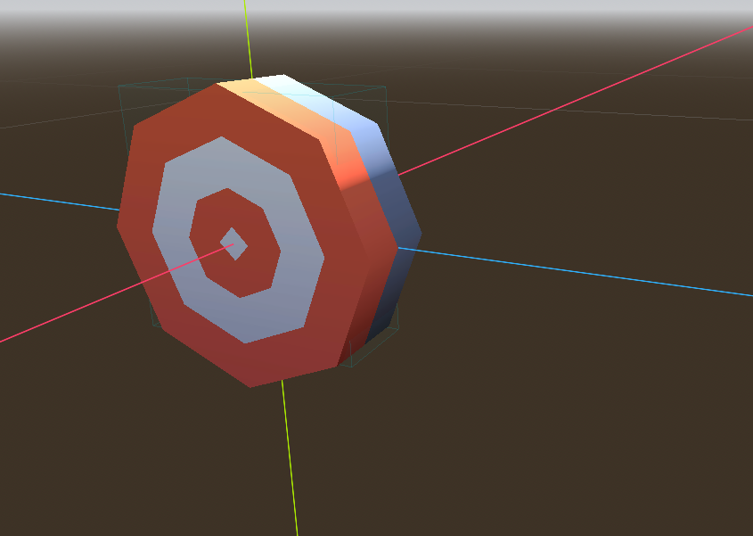
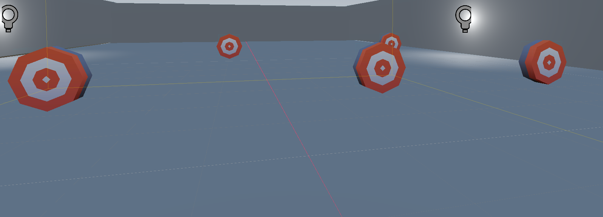

# Dianas (Targets)

En esta sección, vamos a añadir los objetivos (dianas) a nuestra escena principal para que el jugador pueda interactuar con ellos en nuestro juego de VR.

Comenzaremos por crear una nueva escena para un objetivo (diana) en nuestro juego de VR. Para ello, iremos a **Scene > New Scene** y seleccionaremos el tipo de nodo **Area3D** como nodo raíz de nuestra nueva escena. Esto nos permitirá detectar las colisiones entre el jugador y el objetivo (diana) en nuestro juego de VR.

Añadiremos los siguientes nodos a nuestra escena de objetivo (diana):

* **CollisionShape3D**: Este nodo nos permitirá definir la forma de colisión de nuestro objetivo (diana) para que el jugador pueda interactuar con él en VR. Para ello, añadiremos un nuevo recurso de forma de colisión (CollisionShape3D) y seleccionaremos la forma que mejor se adapte a nuestro objetivo (diana); por ejemplo, una esfera o un cubo. En nuestro caso usaremos un cubo para la forma de colisión de nuestro objetivo (diana).
* **Modelo**: en este caso vamos a introducir un modelo 3D de una diana; que hemos descargado anteriormente. Vamos a arrastrar el fichbero fbx para importar el modelo de la diana a nuestro proyecto, y luego lo añadiremos a nuestra escena de objetivo (diana) como un nodo hijo del nodo raíz Area3D. Esto nos permitirá que el modelo de la diana se muestre en nuestra escena de VR y que el jugador pueda interactuar con él utilizando las herramientas de VR de Godot.

!!! note
    Para importar el modelo de la diana, basta con arrastrar y soltar el archivo .fbx en la carpeta de tu proyecto en el editor de Godot. Puede ser que no detecte las texturas asociadas al modelo; por lo que tendrás que hacer doble click en el modelo y configurar las texturas.

Si todo va correctamente, deberías ver el modelo de la diana en tu escena de VR, más adelante podremos añadir la lógica para que el jugador pueda interactuar con el objetivo (diana) y disparar a él utilizando el arma que crearemos en la siguiente sección de este curso.

## Añadir múltiples objetivos (dianas)

Una vez que tenemos creada la escena de nuestro objetivo (diana), vamos a crear múltiples instancias de este objetivo (diana) en nuestra escena principal para que el jugador tenga varios objetivos a los que disparar en nuestro juego de VR.

Recomendamos crear un nodo **Node3D** como nodo padre de todas las instancias de nuestro objetivo (diana) para mantener nuestra escena organizada; a este nodo lo llamaremos "Targets" o "Dianas".

Para ello, iremos a nuestra escena principal y añadiremos un nuevo nodo **Node3D** que llamaremos "Targets" o "Dianas". Luego, arrastraremos y soltaremos la escena de nuestro objetivo (diana) como un nodo hijo del nodo _Node3D_ que acabamos de crear; al que llamaremos "Targets" o "Dianas". Esto creará una instancia de nuestro objetivo (diana) en nuestra escena principal.

Podemos repetir este proceso para crear varias instancias de nuestro objetivo (diana) en nuestra escena principal, y posicionarlas en diferentes lugares de la habitación para que el jugador tenga varios objetivos a los que disparar en nuestro juego de VR.

