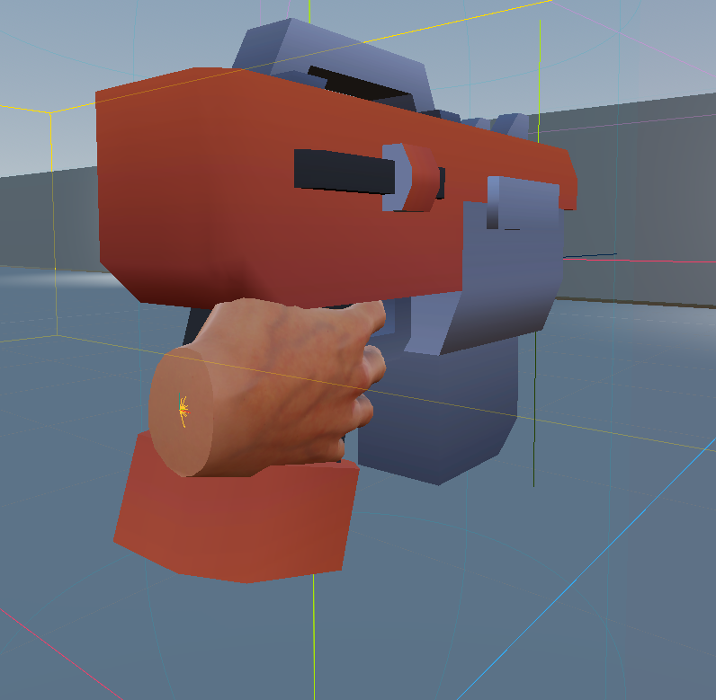
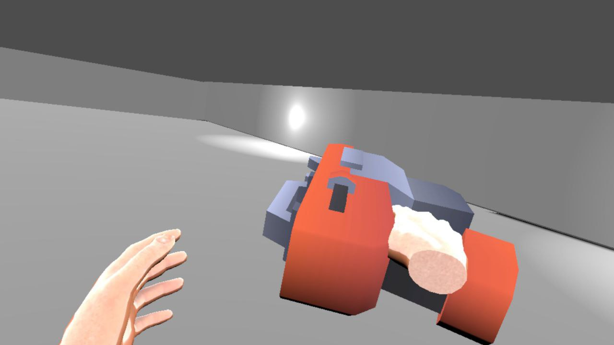

# Arma

Vamos a añadir un arma a nuestro juego de VR para que el jugador pueda disparar a los objetivos (dianas) que hemos creado en la sección anterior.

En nuestro caso, vamos a añadir un nodo **Node3D** como Hijo del controlador de la mano derecha del jugador (**XRController**) para representar el arma en nuestra escena de VR. A este nodo lo llamaremos "Gun" o "Arma".

Una vez hecho esto, vamos a arrastrar el modelo 3D del arma que hemos importado en la sección de _Importar Recursos_ a nuestro proyecto, y lo añadiremos como un nodo hijo del nodo "Gun" o "Arma" que acabamos de crear. Esto nos permitirá que el modelo del arma se muestre en nuestra escena de VR y que el jugador pueda interactuar con él utilizando las herramientas de VR de Godot.

Para una mejor interacción, recomendamos ajustar la posición y la rotación del modelo del arma para que se alinee correctamente con la mano del jugador en VR. Esto se puede hacer seleccionando el nodo del modelo del arma y ajustando sus propiedades de transformación (posición, rotación y escala) en el editor de Godot.

Ahora, podemos probar la aplicación en nuestro dispositivo VR para ver el arma en la mano del jugador y asegurarnos de que se muestra correctamente en nuestra escena de VR. En la siguiente sección, añadiremos la lógica para que el jugador pueda disparar a los objetivos (dianas) utilizando el arma que acabamos de añadir a nuestra escena de VR.

